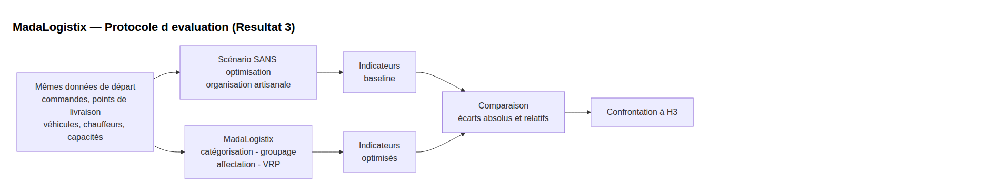
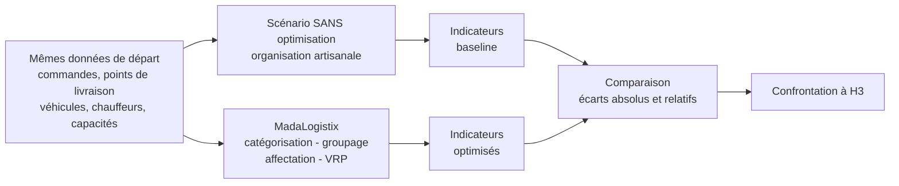

# MadaLogistix — Évaluation du modèle (Résultat 3 du mémoire)

Support opératoire du **Résultat 3** : vérification de l'hypothèse H3 par démarche
expérimentale — **comparaison d'un scénario sans optimisation vs MadaLogistix**,
sur les mêmes données de départ.

- Hypothèse testée (H3) : *l'utilisation des méthodes d'optimisation intégrées
  dans MadaLogistix améliore la performance des opérations logistiques
  (distance, véhicules, remplissage, tournées, coût, CO₂).*
- Théorie et formules : `README-Phases-MadaLogistix.md` § « Note technique —
  Calcul des gains » (§§1–23). Ce fichier n'en est que le **mode d'emploi** :
  protocole, dispositif, **tableaux à remplir** et lecture des résultats.
- **Document mémoire** : `docs/RESULTAT3-comparaison.md` — support de rédaction
  du mémoire (scénario expérimental, tableaux numérotés, figures, confrontation H3).
- Diagrammes du cycle : `docs/sequence-client-cycle-partie1|2.*`.
- Génération des figures : `ml/figure_comparaison.py` (matplotlib).

---

## 1. Démarche expérimentale (3 temps)

### Temps 1 — Scénario de référence SANS optimisation
Organisation artisanale, **sans** les méthodes du système, sur les mêmes données :

| Étape | Référence « sans optimisation » | Source / formule |
|---|---|---|
| Catégorisation | Manuelle : `T_manuel = Σ t_i` (temps par colis) | README-Phases §16 |
| Groupage | Pas de groupage : 1 colis = 1 contenant/trajet (`S_base = N`) | §15 |
| Affectation | Manuelle (premier disponible, sans matrice) | §17 (`C_aff,base`) |
| Tournées | Aller-retour individuel : `Dépôt → Client i → Dépôt`, `D_base = 2Σd(D,C_i)` | §3 |

### Temps 2 — Scénario MadaLogistix
Mêmes données traitées par le pipeline : catégorisation (K-Means),
groupage (FFD par cluster **ou** Knapsack itératif), affectation bipartite
(+ scoring freelance si `FREELANCE`), planification VRP.
Relever les sorties : `POST /comparer`, services de simulation pure,
dashboard `GainsDirectionPage` (`GainsService`).

### Temps 3 — Comparaison par indicateurs
Écarts `Gain = baseline − optimisé`, relatifs `Gain(%) = Gain / baseline × 100`
(§5). Indicateurs : distance, temps, véhicules, taux de remplissage,
nb tournées, carburant, CO₂, coût. **Règle anti-double-comptage (§19)** :
le gain global = `C_base − C_opti` uniquement ; les autres gains l'expliquent,
ils ne s'additionnent pas.

---

## 2. Dispositif expérimental (à fixer une fois, identique pour les 2 scénarios)

| Élément | Valeur retenue |
|---|---|
| Lots (`ml/generate_lot_groupage.py`, seed 42) | S : 30 colis / ~10 demandes (nominal) · M : 120 / ~40 (journée hub) · L : 400 / ~130 (pic, fallback FFD) |
| Hubs / tenant | … (noms, `seuil_remplissage_min`, capacités véhicules) |
| Hypothèses (`GainsResponse.Hypotheses`) | vitesse … km/h · conso … L/100 · fuel … Ar/L · CO₂ … kg/L · coût horaire … Ar/h |
| Distances | vol d'oiseau (Haversine) sauf si `VRP_MATRIX_PROVIDER=osrm` → le préciser |

---

## 3. Résultats — Sans optimisation vs MadaLogistix

### 3.1. Catégorisation : manuelle vs ML

| Lot | Sans opti : `T_manuel` | MadaLogistix : `T_ML` | Gain temps / % | bestK | Silhouette | Davies-Bouldin | Pureté |
|---|---|---|---|---|---|---|---|
| S | … | … | … | … | … | … | … |
| M | … | … | … | … | … | … | … |
| L | … | … | … | … | … | … | … |

Joindre par lot la matrice de confusion clusters × catégories déclarées (A/B/C).

### 3.2. Groupage : sans groupage vs FFD vs Knapsack

Référence sans optimisation : `S_base = N` contenants (1 par colis), taux ≈ faible.

| Lot | Sans opti : nb contenants / taux | FFD : sacs · taux moyen · durée ms | Knapsack : sacs · taux moyen · durée ms | Gagnant (`/comparer`, +0,5 pt) |
|---|---|---|---|---|
| S | … | … | … | … |
| M | … | … | … | … |
| L | … | … | … (fallback FFD si >200/cluster) | … |

### 3.3. Affectation : manuelle vs bipartite

| Lot | Sans opti : méthode / coût `C_aff,base` | MadaLogistix : sacs affectés · incompatibilités évitées · équilibrage | Gain |
|---|---|---|---|
| S / M / L | … | … | … |

### 3.4. Tournées et gains globaux : baseline vs optimisé (tableau clé)

Par lot, sortie `GainsService` (baseline = aller-retour individuels, §3 ;
optimisé = tournées planifiées, §4) :

| Indicateur | Sans opti (baseline) | MadaLogistix (optimisé) | Gain absolu | Gain % |
|---|---|---|---|---|
| Distance totale (km) | … | … | … | … |
| Temps de conduite (h) | … | … | … | … |
| Véhicules utilisés | … | … | … | … |
| Taux remplissage moyen (%) | … | … | … (+…) | — |
| Nombre de tournées | … | … | … | … |
| Carburant (L) | … | … | … | … |
| CO₂ (kg) | … | … | … | … |
| Coût transport (Ar) | … | … | … | … |

Graphiques à produire : (1) barres groupées baseline vs optimisé — distance et coût, S/M/L ;
(2) taux de remplissage moyen par lot ; (3) KPI de synthèse (§23) :
économie Ar · % distance · heures · véhicules · kg CO₂.

---

## 4. Lecture et confrontation à H3

- **Seuil de validation (à fixer avant de conclure)** : ex. *H3 vérifiée si gain
  distance ≥ 20 % sur les 3 lots avec gain coût positif.* Puis verdict par lot et global.
- **Ce que la comparaison montre** : écarts imputables au traitement (mêmes données
  de départ → facteurs extérieurs neutralisés), étape par étape puis globalement.
- **Limites à assumer** : baseline volontairement naïve (majore le gain) ;
  vol d'oiseau vs routier (préciser si OSRM utilisé) ; demandes/tournées ignorées
  et fallbacks — citer les champs `Perimetre` de `GainsResponse`
  (`nbDemandesIgnorees`, `nbTourneesFallback`) ; lots synthétiques (profils réalistes :
  riz, tôles, pharmacie, bijouterie…) ; ponctualité/fenêtres horaires non mesurées ici.
- Présentation mémoire : tableaux numérotés + 3 graphiques dans le corps,
  captures `GainsDirectionPage` / `OptimisationPage` en annexe.
