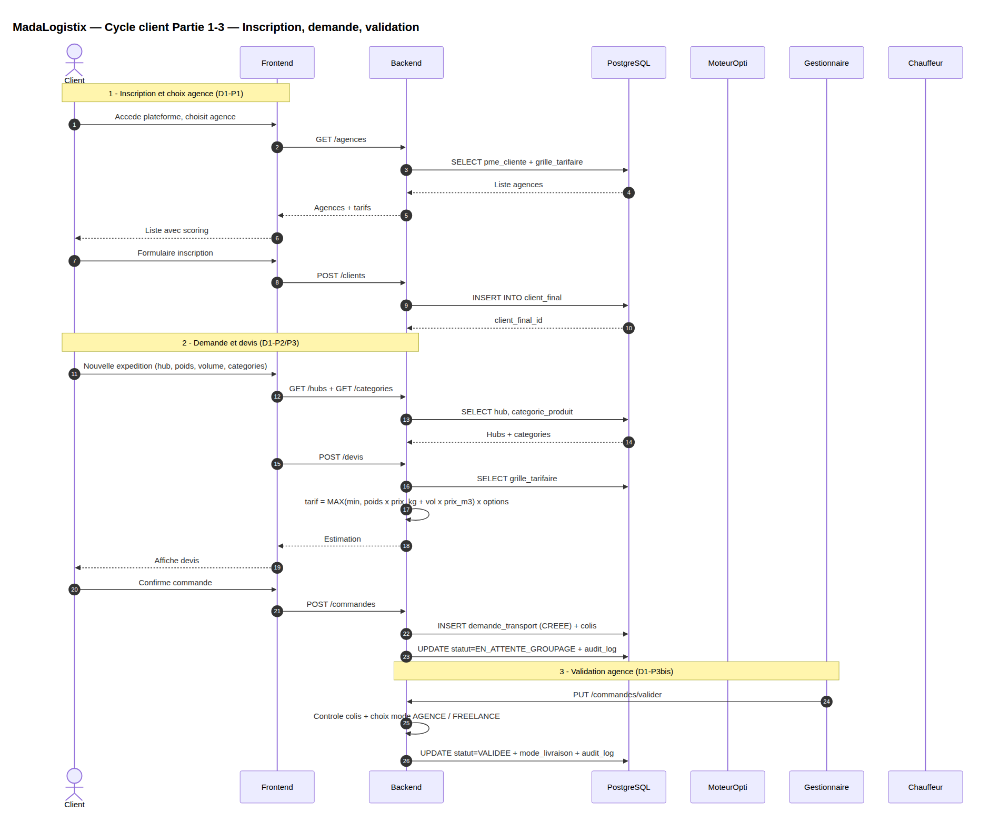
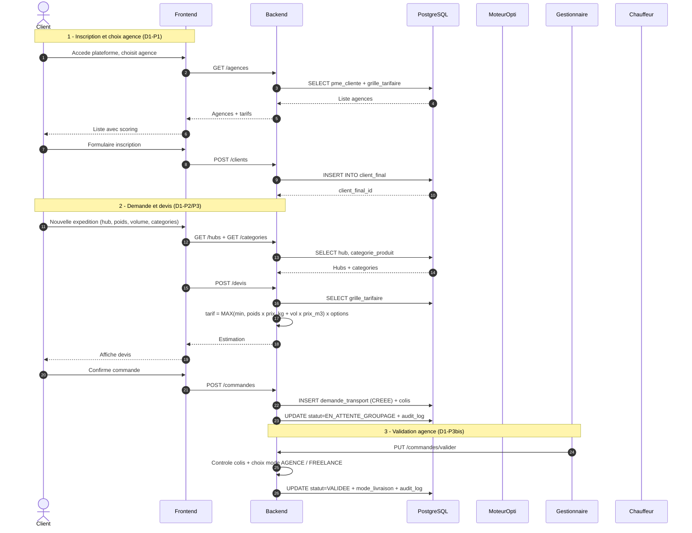
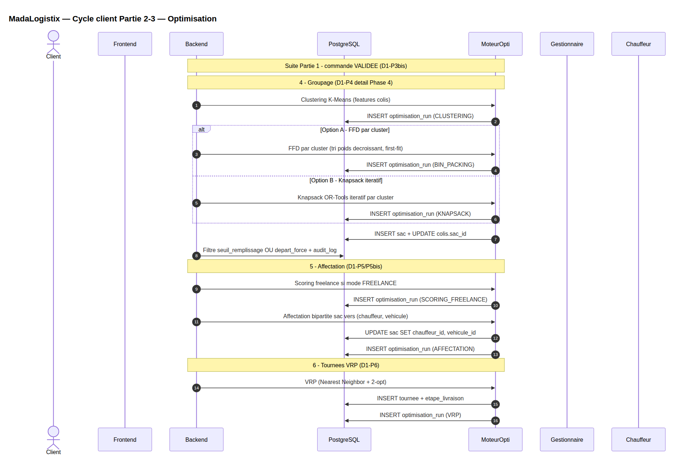
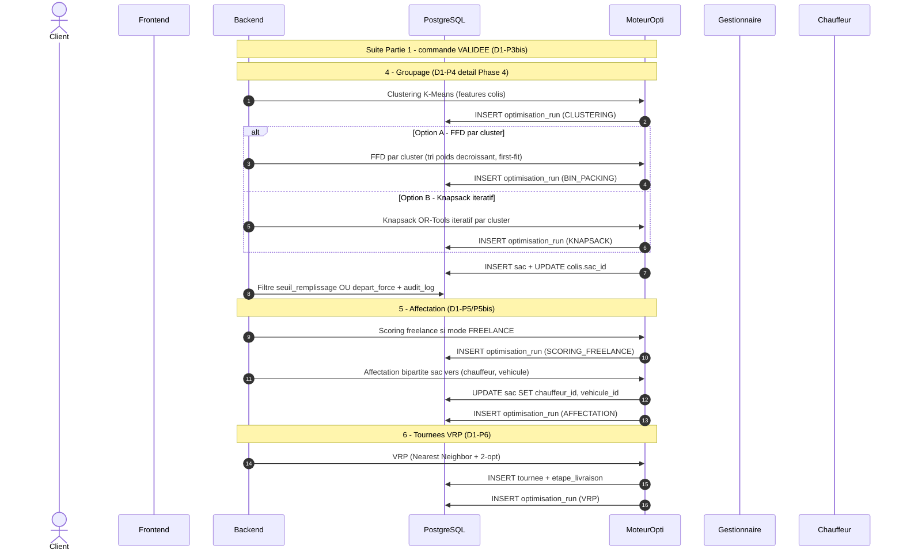
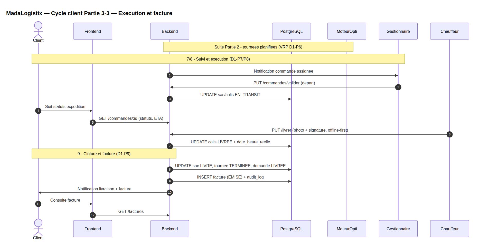
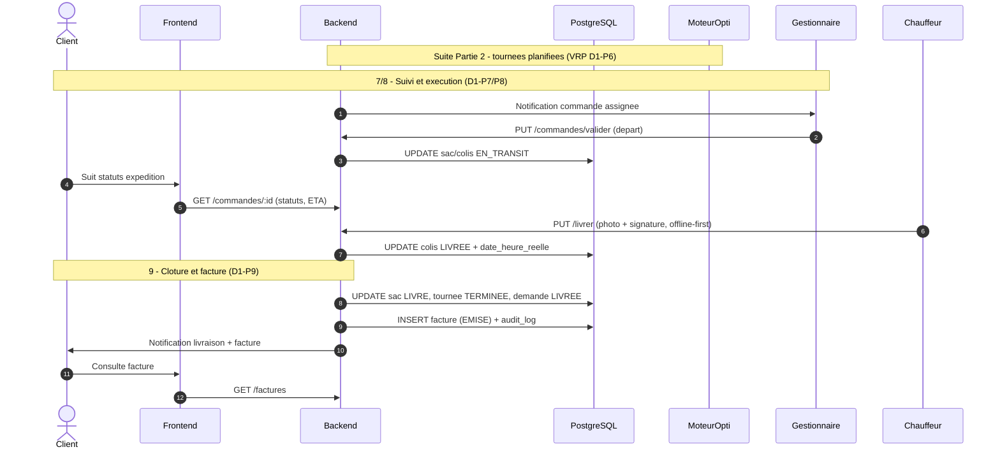

# MadaLogistix — Documentation des Phases des Diagrammes de Séquence

Ce document détaille chaque phase des deux diagrammes de séquence du projet MadaLogistix : le **parcours de commande client** (Diagramme 1) et **l'onboarding d'une agence** (Diagramme 2), avec en tête une **vue condensée du cycle principal vu Client**. Pour chaque phase : objectif, caractéristiques techniques, et formules/algorithmes utilisés.

---

## Diagramme de séquence — Cycle principal vu Client

Vue condensée du cycle complet centrée sur le client : tout ce que le client voit
(inscription, devis, commande, suivi, facture), avec les coulisses
(groupage, affectation, VRP) en participants secondaires.
Découpée en **3 parties** pour rester lisible en pleine page (livre/mémoire) :
**Partie 1** inscription, demande et validation,
**Partie 2** optimisation (groupage, affectation, VRP),
**Partie 3** exécution terrain et facture.
Version exhaustive : `diagramme-sequence.md` (Diagramme 1).
Détail des algorithmes : Phase 4 ci-dessous.

### Partie 1/3 — Inscription, demande et validation (D1-P1 à P3bis)





### Partie 2/3 — Optimisation : groupage, affectation, VRP (D1-P4 à P6)





### Partie 3/3 — Exécution et facture (D1-P7 à P9)





**Légende :** le client n'interagit qu'avec `Frontend` ; `MoteurOpti` (clustering,
FFD/Knapsack, affectation, VRP) et `PostgreSQL` sont les coulisses.
`Gestionnaire` intervient en validation (P3bis) et départ (P7),
`Chauffeur` en exécution terrain (P8, PWA offline-first).
La numérotation recommence à 1 dans chaque partie (limite Mermaid) :
citer les figures comme « Partie 1/3 », « Partie 2/3 » et « Partie 3/3 ».
Sources exportables : `docs/sequence-client-cycle-p1.mmd`,
`docs/sequence-client-cycle-p2.mmd`, `docs/sequence-client-cycle-p3.mmd`.

---

## DIAGRAMME 1 — Commande Complète

### Phase 1 — Inscription & Choix de l'agence
**Objectif** : le client final consulte les agences disponibles et crée son compte.

**Caractéristiques**
- Multi-tenant : chaque agence (`pme_cliente`) est un tenant isolé
- Le client choisit une agence avant toute demande de transport

**Recommandation d'agence (à intégrer ici)**
Score pondéré combinant zone, tarif, fiabilité et délai :

```
score(agence) = w1 × proximité_zone
              + w2 × (1 / tarif_normalisé)
              + w3 × fiabilité_historique
              + w4 × (1 / délai_moyen_normalisé)
```

- `proximité_zone` : 1 si un hub de l'agence couvre l'axe départ-arrivée demandé, sinon exclu du classement
- `fiabilité_historique` = nb livraisons à l'heure / nb livraisons totales (sur `demande_transport`)
- `délai_moyen_normalisé` calculé à partir de l'historique `etape_livraison` (date_heure_reelle - date_heure_prevue)
- Poids `w1..w4` ajustables ; V1 recommandée : priorité zone > tarif > fiabilité > délai

**Sélection de catégories évolutives**
Au moment de l'inscription/de la demande, le client coche une ou plusieurs catégories parmi celles déjà existantes (`categorie_produit`) plutôt que de choisir dans une liste figée.

- Liste des catégories affichée dynamiquement (`GET /categories`) — pas de valeurs codées en dur côté frontend
- Si aucune catégorie existante ne correspond, le client (ou le gestionnaire) peut en proposer une nouvelle → `INSERT INTO categorie_produit`
- Le référentiel de catégories grandit donc organiquement avec l'usage, tenant par tenant
- Ces catégories cochées à la Phase 1/2 sont ensuite le point de départ (labels initiaux) exploitable par le clustering non supervisé de la Phase 4 : soit comme features catégorielles, soit comme vérité terrain partielle pour valider les clusters générés

---

### Phase 2 — Soumission de la demande de transport
**Objectif** : le client remplit les infos d'expédition et obtient un devis.

**Caractéristiques**
- Sélection du hub de départ
- Calcul de devis en temps réel avant confirmation

**Formule de tarification**
```
tarif_base = MAX(prix_minimum, poids_kg × prix_par_kg + volume_m3 × prix_par_m3)

tarif_final = tarif_base
            × (1 + 0.10 si assurance)
            × (1 + 0.25 si express)
```
- Grille tarifaire différenciée par catégorie (Standard / Express / Fragile-Valeur)
- `prix_minimum` évite la sous-tarification des petits colis

---

### Phase 3 — Création de la commande et des colis
**Objectif** : matérialiser la demande en enregistrements exploitables par le système.

**Caractéristiques**
- Une commande (`demande_transport`) se décompose en N `colis`
- Statut initial : `CREEE` → `EN_ATTENTE_GROUPAGE`
- Traçabilité via `audit_log` à chaque étape critique

---

### Phase 3bis — Validation de la commande par le Responsable Logistique
**Objectif** : le Responsable Logistique (agence) valide la commande soumise et affecte le mode de livraison.

**Caractéristiques**
- La commande passe de `CREEE` → `VALIDEE` après contrôle manuel
- Le Responsable Logistique choisit le **mode de livraison** : chauffeur de l'agence OU freelance
- Ce choix détermine le pool de chauffeurs candidats en Phase 5 (affectation bipartite)

**Logique de validation**
```
valider_commande(commande, mode_livraison) →
  1. Vérifier complétude des colis (poids, volume, catégorie)
  2. Si mode = 'agence' → marquer `mode_livraison = 'AGENCE'`
     → Phase 5 utilise la matrice compatibilite_chauffeur_vehicule de l'agence
  3. Si mode = 'freelance' → marquer `mode_livraison = 'FREELANCE'`
     → Phase 5bis active le scoring freelance avant affectation bipartite
  4. Tracer dans audit_log (type VALIDATION_COMMANDE)
```

**Règles de décision**
| Critère | Chauffeur agence | Freelance |
|---|---|---|
| Disponibilité interne | Chauffeurs de l'agence disponibles | Aucun chauffeur agence dispo |
| Coût | Coût fixe agence | Coût variable freelance (score + enchère) |
| Fiabilité | Connu (historique interne) | Évalué via scoring (Phase 5bis) |
| Zone | Hub de rattachement | Rayon d'action configurable |
| Urgence | Tournée planifiée | Mission ponctuelle immédiate |

**Impact sur les phases suivantes**
- `mode_livraison = 'AGENCE'` → Phase 5 seule (affectation bipartite classique)
- `mode_livraison = 'FREELANCE'` → Phase 5bis (scoring freelance) → Phase 5 (affectation bipartite avec pool fusionné)
- Le choix est irréversible après validation (retour à `CREEE` nécessite une annulation)

---

### Phase 4 — Optimisation du groupage (Clustering + FFD / Knapsack itératif)
**Objectif** : regrouper les colis en `sacs` homogènes pour maximiser le taux de remplissage des véhicules.

**Caractéristiques**
- Pipeline en 3 temps : **clustering (4.0)** → **remplissage (4.1 FFD ou 4.2 Knapsack)** → **filtre départ**
- Contraintes doubles partout : capacité poids ET capacité volume (plus grand véhicule `DISPONIBLE` du hub, défaut `5000 kg / 20 m³`)
- Filtre de départ double, identique pour les deux options : sac retenu si `taux ≥ seuil_remplissage_min` (tenant, ex. 80%) **OU** `depart_force` (`today ≥ date_depart_calculee`, `min` des demandes du sac)
- `taux_remplissage = max(Σ poids / cap_poids, Σ volume / cap_volume) × 100`
- Traçabilité : un `optimisation_run` par étape (`CLUSTERING`, puis `BIN_PACKING` ou `KNAPSACK`)

#### 4.0 — Clustering non supervisé en amont (K-Means)
Regroupe les colis par similarité **avant** le remplissage, pour ne jamais mélanger
dans un même sac des colis incompatibles (ex. fragile + robuste) même quand la capacité le permettrait.
Implémentation : `CategorisationService`, `ColisFeatureExtractor`, `ClusteringMetrics` (lib Smile).

```
features_colis = [poids_kg, volume_m3, log1p(valeur_estimee_Ar), fragilite_0_10, delai_express_0_1]
                 # lus depuis colis_features (BDD tenant), standardisation z-score (moyenne 0, variance 1)
matrice_std = standardize(features_colis)
k ∈ [n, min(n+2, 8)]  avec n = nb categories actives ML-activables du tenant (dynamique, cf. Phase 1)
pour k testé : labels, centroides = KMeans(matrice_std, k)
bestK = argmax(silhouette)   # + inertie (elbow), Davies-Bouldin, purete / confusion vs categories declarees
clusters = KMeans(matrice_std, k=bestK)
```

- `k` évolue avec le référentiel de catégories (Phase 1/2) : le clustering suit la croissance organique du catalogue, tenant par tenant
- Matching centroïdes vs `seuils_ml` de `categorie_produit` (distance euclidienne normalisée) : chaque cluster est rattaché à une classe (A/B/C/…)
- Double usage : **contraindre** le remplissage (un sac = un seul cluster → homogénéité garantie) et **proposer** une nouvelle catégorie (cluster sans correspondant → candidat à `categorie_produit`)
- Tracé dans `optimisation_run` (type `CLUSTERING`) avec `k` testés, silhouette, Davies-Bouldin, pureté, `referentiel_version`
- En pratique le groupage partitionne ensuite par `categorie.classe_code` (fallback `STANDARD`) : c'est la projection opérationnelle du clustering

#### 4.1 — Option A : FFD par cluster (heuristique gloutonne)
Implémentation : `GroupageFfdClusterService` + `BinPackingService`. Simulation pure
(aucun `Sac` persisté, seul l'`OptimisationRun` est créé ; la persistance a lieu au `/valider`).

```
partitionner colis EN_ATTENTE_GROUPAGE par cluster (classe_code, TreeMap deterministe)
capacite = PLUS GRAND vehicule DISPONIBLE du hub (poids_kg, volume_m3, SCALE=100)
pour chaque cluster :
    trier colis par poids decroissant                      # Decreasing
    pour chaque colis : le mettre dans le PREMIER sac qui tient (poids ET volume)  # First Fit
                        sinon ouvrir un nouveau sac
    pour chaque sac FFD :
        taux = max(poids_sac/cap_poids, volume_sac/cap_volume) x 100
        garder si taux >= seuil_remplissage_min OU depart_force
```

- Garantie théorique : `11/9 × OPT + 1` (Johnson 1973) — rapide, adaptée aux gros volumes
- Complexité quasi-linéaire : l'option par défaut quand la vitesse prime ou en fallback (voir 4.2)
- Justification auto générée : capacité, seuil, clusters, taux par sac, `[DEPART FORCE]`

#### 4.2 — Option B : Knapsack itératif par cluster (exact, OR-Tools)
Implémentation : `GroupageKnapsackService` + `KnapsackSolverService`
(`KNAPSACK_DYNAMIC_PROGRAMMING_SOLVER`, 2 contraintes). Même partition par cluster,
puis **boucle itérative** : chaque résolution donne le meilleur sac possible,
les colis retenus sont retirés, on recommence jusqu'à épuisement du cluster.

```
maximiser  Σ (poids_i × x_i)            # valeur = poids (proxy remplissage)
sous contrainte :
  Σ (poids_i × x_i) ≤ capacite_poids_kg
  Σ (volume_i × x_i) ≤ capacite_volume_m3
  x_i ∈ {0,1}
répéter : resoudre → sac (si taux >= seuil OU depart_force) → retirer colis → recommencer
```

- Bornes de sécurité (mémoire/temps) : `SCALE` adaptatif `100 → 10 → 1` selon
  `capacite_poids × capacite_volume ≤ DP_TABLE_MAX (10M)` ; `MAX_COLIS_PAR_CLUSTER = 200` → **fallback FFD** automatique au-delà
- Garantie exacte sur l'instance donnée (programmation dynamique) — optimal sac par sac, à privilégier sur petits/moyens lots
- `valeur_optimale` du solveur + flag `fallback_ffd` conservés par sac dans le JSON de résultat

#### 4.3 — Comparatif et choix

| Critère | Option A — FFD par cluster | Option B — Knapsack itératif |
|---|---|---|
| Type | Heuristique gloutonne | Exact (prog. dynamique OR-Tools) |
| Garantie | `11/9·OPT+1` | Optimal par itération |
| Vitesse | Très rapide, gros volumes | Plus lent, borné (`SCALE` adaptatif, max 200 colis/cluster) |
| Sac | Homogène (1 cluster) | Homogène (1 cluster) |
| Dépasse capacité cluster | N/A (FFD passe à l'échelle) | Fallback FFD automatique |
| Trace | `BIN_PACKING` + justification FR | `KNAPSACK` + `valeur_optimale` + justification FR |
| Quand l'utiliser | Défaut temps réel, pics (>200/cluster) | Lots modestes, recherche du meilleur remplissage |

- Les deux options partagent capacité, partition, taux `max(poids, volume)` et règle seuil/départ forcé : elles sont donc comparables sac à sac (écran `OptimisationPage` : `FFD BinPacking` vs `Knapsack`)
- Résultat commun : `INSERT INTO sac`, `UPDATE colis SET sac_id`, demandes candidates → `GROUPEE`, `audit_log`

---

### Phase 5 — Affectation Chauffeur × Véhicule
**Objectif** : assigner chaque sac constitué à une paire (chauffeur, véhicule) compatible et disponible.

**Caractéristiques**
- Matrice de compatibilité pré-configurée (`compatibilite_chauffeur_vehicule`)
- Problème d'**affectation bipartite** (sacs ↔ paires chauffeur-véhicule)

**Logique**
```
affecter(sac) → argmax(compatibilité) parmi { (chauffeur, véhicule) | disponible=true ET compatible=true }
```
- Objectif secondaire : équilibrer la charge de travail entre chauffeurs disponibles
- Tracé dans `optimisation_run` (type `AFFECTATION`)

**Formulation mathématique (affectation bipartite)**

Variables : `y_{s,p} ∈ {0,1}` = 1 si le sac `s` est affecté à la paire `p = (chauffeur, véhicule)`

```
maximiser  Σ Σ (compat_{s,p} × y_{s,p}) - λ × écart_charge

sous contrainte :
  Σ_p y_{s,p} = 1                    pour chaque sac s (un seul chauffeur/véhicule par sac)
  Σ_s y_{s,p} ≤ 1                    pour chaque paire p (un chauffeur/véhicule ne gère qu'un sac à la fois)
  y_{s,p} = 0  si compatible(chauffeur,véhicule) = false
  y_{s,p} = 0  si habilite_valeur(chauffeur) = false ET categorie_dominante(sac) = 'A'
```

- `compat_{s,p}` = 1 si la paire figure dans `compatibilite_chauffeur_vehicule` avec `compatible=true`, 0 sinon
- `écart_charge` = variance du nombre de sacs déjà affectés par chauffeur sur la période (pénalise la surcharge d'un même chauffeur)
- `λ` : poids de l'équilibrage — ajustable selon la priorité opérationnelle de l'agence
- Cas simple (peu de sacs/chauffeurs) : résolution gloutonne (meilleure compatibilité restante) suffisante ; cas plus large : algorithme hongrois (Hungarian algorithm) pour l'optimalité garantie

---

### Phase 5bis — Scoring de proposition de mission (Chauffeurs Freelance)
**Objectif** : dans le modèle mixte (chauffeur rattaché à une agence OU freelance), proposer une mission aux chauffeurs freelance disponibles selon un score pondéré, sur le même principe que le scoring de recommandation d'agence (D1-P1).

**Caractéristiques**
- Les chauffeurs freelance n'ont pas de hub de rattachement ni de matrice de compatibilité pré-configurée (contrairement aux chauffeurs rattachés)
- Le scoring remplace dynamiquement cette matrice absente, en amont de l'affectation bipartite (Phase 5)

**Formule de scoring**
```
score(chauffeur, mission) = w1 × proximité_chauffeur
                           + w2 × compatibilité_véhicule
                           + w3 × fiabilité_chauffeur
                           + w4 × disponibilité_immédiate
                           + w5 × (1 / charge_actuelle_normalisée)
```

- `proximité_chauffeur` : inverse de la distance entre la position actuelle du chauffeur et le point de départ de la mission — normalisée [0,1], exclu si hors rayon d'action configurable (ex. 15 km)
- `compatibilité_véhicule` : contrainte dure — 1 si poids/volume du sac respectés ET `habilite_valeur=true` si catégorie A, sinon le chauffeur est exclu du classement
- `fiabilité_chauffeur` = nb missions terminées à l'heure / nb missions totales (équivalent freelance de la `fiabilité_historique` agence, D1-P1)
- `disponibilité_immédiate` : 1 si le chauffeur n'est pas déjà en tournée, sinon fortement pénalisé/exclu
- `charge_actuelle_normalisée` : nb de missions déjà acceptées/en cours sur la journée — favorise l'équilibrage entre freelances actifs

**Poids recommandés (V1)** : proximité > fiabilité > disponibilité > équilibrage charge (compatibilité étant une contrainte dure, pas un poids).

**Intégration dans l'affectation bipartite (Phase 5, Diagramme 1)**
```
Pour chaque sac à affecter :
  1. Filtrer les chauffeurs RATTACHÉS à l'agence (matrice compatibilite_chauffeur_vehicule existante)
  2. Filtrer les chauffeurs FREELANCE disponibles (scoring ci-dessus)
  3. Fusionner les deux pools candidats
  4. Appliquer l'affectation bipartite sur l'ensemble fusionné
```
- Pour les freelances, `compat_{s,p}` dans la formulation bipartite (D1-P5) devient le `score(chauffeur, mission)` continu, au lieu du booléen issu de la matrice pré-configurée (qui n'existe pas pour eux)

**Traçabilité**
- Journalisable dans `optimisation_run` (nouveau sous-type `SCORING_FREELANCE`), exécuté en amont de l'affectation bipartite — même pattern que le clustering en amont du Knapsack (D1-P4)

---

### Phase 6 — Planification des tournées (VRP)
**Objectif** : déterminer l'ordre optimal de collecte/livraison pour chaque tournée.

**Caractéristiques**
- **Vehicle Routing Problem (VRP)**, variante avec fenêtres horaires
- Une tournée = une séquence d'`etape_livraison` ordonnées

**Formule d'objectif**
```
minimiser  Σ distance(étape_i, étape_i+1)
sous contrainte : date_heure_prevue ∈ fenêtre_horaire_client
```
- Résultat stocké avec `distance_totale_km` par tournée
- Tracé dans `optimisation_run` (type `VRP`)

**Formulation mathématique (VRP avec fenêtres horaires — VRPTW)**

Variables : `z_{i,j} ∈ {0,1}` = 1 si la tournée va directement de l'étape `i` à l'étape `j`

```
minimiser  Σ Σ (distance_{i,j} × z_{i,j})

sous contrainte :
  Σ_j z_{i,j} = 1                         chaque étape i a exactement un successeur
  Σ_i z_{i,j} = 1                         chaque étape j a exactement un prédécesseur
  charge_cumulée(tournée) ≤ capacité_véhicule     (poids et volume, hérité du sac affecté)
  heure_arrivée_prevue(j) ≥ heure_ouverture_fenêtre(j)
  heure_arrivée_prevue(j) ≤ heure_fermeture_fenêtre(j)
  élimination de sous-tours (contrainte MTZ ou équivalent)
```

- `distance_{i,j}` : distance routière réelle entre deux points (API cartographique) ou euclidienne en approximation MVP
- Fenêtre horaire par défaut : plage de la journée de livraison si le client n'en précise pas
- Complexité NP-difficile ⇒ heuristique recommandée pour le MVP :
  - **Nearest Neighbor** pour une solution initiale rapide
  - **2-opt** (échange de segments) pour l'améliorer localement
  - Solveur exact (ex. OR-Tools) envisageable en V2 si le nombre d'étapes par tournée reste modéré (< 20-30)

---

### Phase 7 — Notification et réception par l'agence
**Objectif** : l'agence valide la commande groupée avant exécution terrain.

**Caractéristiques**
- Point de contrôle humain avant transition `EN_TRANSIT`
- Vue consolidée : commande + colis + sac + chauffeur + véhicule (jointure multi-table)
- Étape déclenchée par événement (notification), pas par polling

---

### Phase 8 — Exécution par le Chauffeur
**Objectif** : suivi terrain de la collecte et de la livraison.

**Caractéristiques**
- Application pensée **offline-first (PWA)** : actions rejouées à la reconnexion
- Preuve de livraison : photo + signature numérique obligatoires
- Horodatage réel (`date_heure_reelle`) comparé au prévisionnel pour calculer la fiabilité (cf. Phase 1)

---

### Phase 9 — Clôture et facturation
**Objectif** : générer la facture et clore le cycle de vie de la commande.

**Caractéristiques**
- Cascade de statuts : sac → tournée → demande_transport, tous passés à leur état terminal
- Facture liée à la demande, statut `EMISE` par défaut
- Double notification (client + agence) en fin de cycle

---

## DIAGRAMME 2 — Inscription Agence via Clé et Configuration

### Phase 1 — Génération de la clé d'invitation
**Objectif** : contrôle d'accès pour éviter la création libre de tenants.

**Caractéristiques**
- Clé unique horodatée (`ML-YYYY-XXXXXXX`), durée de validité configurable (ex. 30 jours)
- Envoi hors-bande (email) — la clé seule ne suffit pas à valider l'inscription

---

### Phase 2 — Inscription de l'agence via la clé
**Objectif** : créer le tenant (`pme_cliente`) et le premier utilisateur (rôle DIRECTION).

**Caractéristiques**
- Opération transactionnelle (BEGIN/COMMIT) : tenant + utilisateur créés atomiquement
- Mot de passe hashé (bcrypt) avant stockage
- Clé marquée `utilise=true` pour empêcher la réutilisation
- `seuil_remplissage_min` initialisé à une valeur par défaut (80%)

---

### Phase 3 — Création des Hubs
**Objectif** : définir les points d'entrepôt physiques de l'agence.

**Caractéristiques**
- Un hub peut être marqué zone sécurisée (pertinent pour colis classe A/fragile)
- Aucune limite structurelle au nombre de hubs par tenant

---

### Phase 4 — Configuration de la grille tarifaire
**Objectif** : définir les grilles de prix par niveau de service.

**Caractéristiques**
- Plusieurs grilles actives simultanément (Standard / Express / Fragile-Valeur)
- Chaque grille alimente directement la formule de tarification (voir Diagramme 1, Phase 2)

| Grille | Prix/kg | Prix/m³ | Prix minimum |
|---|---|---|---|
| Standard | 2 500 Ar | 50 000 Ar | 15 000 Ar |
| Express | 4 000 Ar | 80 000 Ar | 25 000 Ar |
| Fragile/Valeur | 6 000 Ar | 100 000 Ar | 35 000 Ar |

---

### Phase 5 — Catégories de produits (classification ABC)
**Objectif** : segmenter les colis par sensibilité/valeur.

**Caractéristiques**
- Classement ABC classique : A = fragile/haute valeur, B = standard, C = robuste
- Sert de filtre dans l'algorithme de groupage (Phase 4, Diagramme 1) pour éviter de mélanger classe A et C dans un même sac

---

### Phase 6 — Ajout de l'équipe (Utilisateurs)
**Objectif** : peupler les rôles opérationnels (gestionnaire, chauffeurs).

**Caractéristiques**
- Rôles distincts : GESTIONNAIRE, CHAUFFEUR (avec sous-entité `chauffeur` : téléphone, disponibilité, habilitation valeur)
- `habilite_valeur=true` conditionne l'affectation à des sacs classe A

---

### Phase 7 — Ajout des véhicules
**Objectif** : constituer la flotte disponible pour le groupage et les tournées.

**Caractéristiques**
- Capacité double (poids_kg + volume_m3) — directement injectée dans la contrainte Knapsack (Phase 4, Diagramme 1)
- Rattaché à un hub précis (véhicule non mutualisable entre hubs sans réaffectation)

---

### Phase 8 — Compatibilités Chauffeur × Véhicule
**Objectif** : pré-calculer la matrice utilisée par l'algorithme d'affectation (Phase 5, Diagramme 1).

**Caractéristiques**
- Matrice N chauffeurs × M véhicules, remplie manuellement à la configuration
- Évite les affectations invalides (ex. permis non adapté) au moment de l'optimisation en temps réel

---

### Phase 9 — Paramètres globaux
**Objectif** : ajuster les seuils métier de l'agence.

**Caractéristiques**
- `seuil_remplissage_min` modifiable a posteriori — impacte directement la contrainte de la Phase 4 (Diagramme 1)
- Toute modification tracée dans `audit_log`

---

### Phase 10 — Vérification et activation
**Objectif** : contrôle final avant mise en production du tenant.

**Caractéristiques**
- Checklist automatique : hubs, grilles, catégories, utilisateurs, chauffeurs, véhicules, compatibilités, seuil
- Activation = passage à un état "prêt à recevoir des commandes", condition préalable à l'apparition de l'agence dans la Phase 1 du Diagramme 1

---

## Synthèse des algorithmes d'optimisation utilisés

| Phase | Algorithme | Type de problème | Objectif |
|---|---|---|---|
| D1-P4 | Clustering K-Means + FFD par cluster / Knapsack itératif OR-Tools | Non supervisé + combinatoire, NP-difficile | Sacs homogènes, maximiser remplissage sous poids/volume, seuil OU départ forcé |
| D1-P5 | Affectation bipartite | Matching | Assigner sac → (chauffeur, véhicule) compatible |
| D1-P6 | VRP (Vehicle Routing Problem) | Combinatoire, NP-difficile | Minimiser distance sous fenêtres horaires |
| D1-P1 (proposé) | Scoring pondéré | Aide à la décision | Recommander la meilleure agence au client |

---

## Note technique — Calcul des gains d'optimisation de MadaLogistiX

### 1. Objectif

L'objectif est de mesurer quantitativement l'apport de MadaLogistiX en comparant deux scénarios appliqués aux mêmes données de livraison :

- **Scénario de référence (Baseline)** : traitement séquentiel/non optimisé.
- **Scénario optimisé** : utilisation des méthodes d'optimisation de MadaLogistiX.

La comparaison porte notamment sur :

- la distance parcourue ;
- le temps nécessaire ;
- le nombre de véhicules utilisés ;
- le coût de transport ;
- la consommation de carburant ;
- les émissions de CO₂ ;
- le temps de traitement des commandes ;
- le taux d'utilisation des capacités.

Pour un indicateur X où une diminution représente une amélioration :

$$ Gain_X = X_{baseline} - X_{optimisé} $$

Le gain relatif est :

$$ Gain_X(\%) = \frac{X_{baseline}-X_{optimisé}}{X_{baseline}} \times 100 $$

### 2. Notations générales

| Symbole | Signification |
|---------|---------------|
| $N$ | Nombre de commandes/livraisons |
| $C_i$ | Client $i$ |
| $D$ | Dépôt ou hub de départ |
| $V$ | Nombre de véhicules |
| $d(A,B)$ | Distance entre deux points |
| $t(A,B)$ | Temps de déplacement entre deux points |
| $q_i$ | Poids/quantité du colis $i$ |
| $Q_v$ | Capacité du véhicule $v$ |
| $P_{fuel}$ | Prix du carburant |
| $r$ | Consommation du véhicule en L/100 km |

### 3. Scénario de référence — Baseline

La baseline représente une stratégie simple et reproductible de planification sans optimisation.

Chaque livraison est traitée individuellement :

```
Dépôt → Client 1 → Dépôt
Dépôt → Client 2 → Dépôt
Dépôt → Client 3 → Dépôt
```

La distance totale de référence est :

$$ D_{base} = \sum_{i=1}^{N} [d(D,C_i)+d(C_i,D)] $$

Si la distance est symétrique :

$$ D_{base}=2\sum_{i=1}^{N}d(D,C_i) $$

**Exemple**

Pour trois clients : $d(D,C_1)=10km$, $d(D,C_2)=15km$, $d(D,C_3)=20km$

$$ D_{base}=2(10+15+20) = 90km $$

### 4. Distance optimisée par le VRP

Le VRP produit plusieurs tournées.

**Exemple :**

- Tournée 1 : D → C1 → C3 → D
- Tournée 2 : D → C2 → C4 → C5 → D

Pour une tournée $R_k$ :

$$ D(R_k) = \sum_{j=0}^{m_k-1} d(P_{k,j},P_{k,j+1}) $$

où :
- $P_{k,0}=D$ ;
- $P_{k,m_k}=D$ ;
- $P_{k,j}$ représente un point de la tournée.

La distance totale optimisée est :

$$ D_{VRP}=\sum_{k=1}^{K}D(R_k) $$

### 5. Gain de distance

Le gain absolu est :

$$ G_D=D_{base}-D_{VRP} $$

Le gain relatif :

$$ G_D(\%)= \frac{D_{base}-D_{VRP}}{D_{base}} \times100 $$

**Exemple**

Si $D_{base}=500km$ et $D_{VRP}=320km$ :

$$ G_D=500-320=180km $$
$$ G_D(\%)= \frac{180}{500}\times100 = 36\% $$

### 6. Calcul du temps de trajet

Pour chaque déplacement :

$$ t_{ij}=\frac{d_{ij}}{v_{ij}} $$

où :
- $d_{ij}$ = distance entre les points $i$ et $j$ ;
- $v_{ij}$ = vitesse moyenne.

Pour une tournée :

$$ T(R_k) = \sum_{j=0}^{m_k-1} \frac{d(P_{k,j},P_{k,j+1})}{v(P_{k,j},P_{k,j+1})} $$

Le temps total :

$$ T_{VRP}=\sum_{k=1}^{K}T(R_k) $$

Le gain de temps :

$$ G_T=T_{base}-T_{VRP} $$

Le gain relatif :

$$ G_T(\%)= \frac{T_{base}-T_{VRP}}{T_{base}} \times100 $$

### 7. Temps total d'une livraison

Le temps de transport ne correspond pas uniquement au temps de conduite.

$$ T_{total} = T_{conduite} + T_{chargement} + T_{déchargement} + T_{service} + T_{attente} $$

Pour $N$ livraisons :

$$ T_{service} = \sum_{i=1}^{N}s_i $$

où $s_i$ représente le temps nécessaire pour effectuer la livraison $i$.

### 8. Nombre de véhicules utilisés

Pour une baseline où chaque livraison est effectuée individuellement :

$$ V_{base}=N $$

Si plusieurs livraisons peuvent être effectuées par un même véhicule :

$$ V_{base} = \left\lceil \frac{N}{L} \right\rceil $$

où $L$ représente le nombre maximal de livraisons réalisables par véhicule.

Pour la solution optimisée :

$$ V_{opt}=K $$

où $K$ représente le nombre de tournées générées.

Le gain est :

$$ G_V=V_{base}-V_{opt} $$

### 9. Utilisation de la capacité des véhicules

Pour un véhicule $v$ :

$$ U_v= \frac{\sum_{i\in v}q_i}{Q_v} \times100 $$

où :
- $q_i$ = poids du colis $i$ ;
- $Q_v$ = capacité du véhicule.

L'utilisation moyenne :

$$ U_{moy} = \frac{1}{V} \sum_{v=1}^{V}U_v $$

La capacité inutilisée :

$$ C_{inutilisée} = \sum_v \left( Q_v-\sum_iq_i \right) $$

Cela permet d'évaluer l'efficacité du groupage.

### 10. Consommation de carburant

Si un véhicule consomme $r$ litres pour 100 km :

$$ L=D\times\frac{r}{100} $$

où :
- $L$ = consommation en litres ;
- $D$ = distance parcourue ;
- $r$ = consommation en L/100 km.

### 11. Coût du carburant

$$ C_{fuel}=L\times P_{fuel} $$

En remplaçant $L$ :

$$ C_{fuel} = D\times\frac{r}{100}\times P_{fuel} $$

### 12. Coût total du transport

$$ C_{transport} = C_{fuel} + C_{main\ d'œuvre} + C_{véhicules} + C_{péages} + C_{autres} $$

Le coût de la main-d'œuvre :

$$ C_{main\ d'œuvre} = T_{travail}\times P_{heure} $$

Le coût fixe des véhicules :

$$ C_{véhicules} = V\times C_{fixe} $$

On peut donc utiliser :

$$ C_{transport} = D\frac{r}{100}P_{fuel} + TP_{heure} + VC_{fixe} + C_{péages} + C_{autres} $$

### 13. Gain financier

Le gain financier global est :

$$ G_{Ar}=C_{base}-C_{optimisé} $$

Le pourcentage d'économie :

$$ G_{Ar}(\%)= \frac{C_{base}-C_{optimisé}}{C_{base}} \times100 $$

**Exemple**

Baseline : $C_{base}=850\,000\ Ar$
Solution optimisée : $C_{optimisé}=560\,000\ Ar$

$$ G_{Ar} = 850\,000-560\,000 = 290\,000\ Ar $$
$$ G_{Ar}(\%) = \frac{290\,000}{850\,000}\times100 \approx 34,12\% $$

### 14. Émissions de CO₂

Si $e$ représente le facteur d'émission en kg CO₂/L :

$$ CO_2=L\times e $$

Donc :

$$ CO_2= D\times\frac{r}{100}\times e $$

Le gain environnemental :

$$ G_{CO_2} = CO_{2,base}-CO_{2,optimisé} $$

Le gain relatif :

$$ G_{CO_2}(\%)= \frac{CO_{2,base}-CO_{2,optimisé}}{CO_{2,base}} \times100 $$

### 15. Gain du groupage

On peut comparer le nombre de contenants nécessaires.

Soit :
- $S_{base}$ = nombre de sacs/contenants dans la baseline ;
- $S_{opt}$ = nombre de sacs/contenants après optimisation.

La réduction est :

$$ G_S=S_{base}-S_{opt} $$

Si un contenant coûte $C_s$ :

$$ G_{groupage} = (S_{base}-S_{opt})C_s $$

Le gain du groupage peut également se traduire par une réduction du nombre de véhicules ou de la distance. Il faut éviter de compter plusieurs fois le même gain.

### 16. Gain de la catégorisation ML

Pour la catégorisation, le principal gain attendu est la réduction du temps de traitement.

**Catégorisation manuelle :**

$$ T_{manuel} = \sum_{i=1}^{N}t_i $$

**Catégorisation avec ML :**

$$ T_{ML} = T_{prediction}+T_{validation} $$

Le gain de temps :

$$ G_{cat} = T_{manuel}-T_{ML} $$

Le gain relatif :

$$ G_{cat}(\%)= \frac{T_{manuel}-T_{ML}}{T_{manuel}} \times100 $$

Si l'on souhaite convertir ce gain en valeur monétaire :

$$ G_{cat,Ar} = G_{cat}\times C_{heure} $$

### 17. Gain de l'affectation

Pour l'affectation chauffeur/véhicule, une fonction de coût peut être définie :

$$ C_{affectation} = \alpha D+ \beta T+ \gamma C+ \delta P $$

avec :
- $D$ = distance ;
- $T$ = temps ;
- $C$ = coût ;
- $P$ = pénalité liée aux contraintes ;
- $\alpha,\beta,\gamma,\delta$ = coefficients de pondération.

On compare $C_{aff,base}$ et $C_{aff,opt}$.

Le gain :

$$ G_{aff} = C_{aff,base}-C_{aff,opt} $$

### 18. Fonction objectif globale

Pour MadaLogistiX, on peut formaliser une fonction objectif générale :

$$ \min Z= \alpha D+ \beta T+ \gamma C+ \delta V+ \epsilon CO_2+ P $$

avec :
- $D$ = distance totale ;
- $T$ = temps total ;
- $C$ = coût ;
- $V$ = nombre de véhicules ;
- $CO_2$ = émissions ;
- $P$ = pénalités liées aux contraintes ;
- $\alpha,\beta,\gamma,\delta,\epsilon$ = poids attribués aux différents objectifs.

Cette formulation permet de passer d'une optimisation uniquement basée sur la distance à une optimisation multicritère.

### 19. Éviter le double comptage des gains

C'est un point essentiel pour l'évaluation expérimentale.

Il ne faut pas simplement écrire :

$$ Gain_{total} = Gain_{VRP} + Gain_{groupage} + Gain_{affectation} + Gain_{carburant} $$

car certains gains sont des conséquences les uns des autres.

**Exemple :**

```
VRP
  ↓
Réduction de la distance
  ↓
Réduction du carburant
  ↓
Réduction du coût
```

Le coût du carburant économisé est déjà inclus dans le gain financier global.

**La méthode recommandée est :**

$$ Gain_{global} = C_{baseline}-C_{MadaLogistiX} $$

Les autres indicateurs servent ensuite à expliquer le gain global.

### 20. Tableau des indicateurs expérimentaux

| Indicateur | Baseline | MadaLogistiX | Gain |
|------------|----------|--------------|------|
| Distance | $D_b$ | $D_o$ | $D_b-D_o$ |
| Temps | $T_b$ | $T_o$ | $T_b-T_o$ |
| Véhicules | $V_b$ | $V_o$ | $V_b-V_o$ |
| Coût transport | $C_b$ | $C_o$ | $C_b-C_o$ |
| Carburant | $L_b$ | $L_o$ | $L_b-L_o$ |
| CO₂ | $CO_{2,b}$ | $CO_{2,o}$ | $CO_{2,b}-CO_{2,o}$ |
| Temps catégorisation | $T_{cat,b}$ | $T_{cat,o}$ | $T_{cat,b}-T_{cat,o}$ |
| Utilisation capacité | $U_b$ | $U_o$ | $U_o-U_b$ |

### 21. Protocole expérimental

Les deux scénarios doivent utiliser exactement les mêmes données.

```
Mêmes commandes
       │
       ├──────────────────┐
       ▼                  ▼
   BASELINE          MADALOGISTIX
       │                  │
       │            Catégorisation
       │                  │
       │               Groupage
       │                  │
       │              Affectation
       │                  │
       │                  VRP
       │                  │
       ▼                  ▼
 D_base, T_base      D_opt, T_opt
 C_base, V_base      C_opt, V_opt
 CO₂_base            CO₂_opt
       │                  │
       └──────────┬───────┘
                  ▼
             COMPARAISON
                  │
       ┌──────────┼──────────┐
       ▼          ▼          ▼
   Gain coût  Gain temps  Gain distance
       │          │          │
       └──────────┼──────────┘
                  ▼
            GAIN GLOBAL
```

### 22. Exemple synthétique

Supposons que 30 commandes soient à livrer.

**Baseline :**

| Indicateur | Valeur |
|------------|--------|
| Distance | 500 km |
| Temps | 40 h |
| Véhicules | 5 |
| Coût | 850 000 Ar |
| Carburant | 75 L |
| CO₂ | 195 kg |

**MadaLogistiX :**

| Indicateur | Valeur |
|------------|--------|
| Distance | 320 km |
| Temps | 27 h |
| Véhicules | 3 |
| Coût | 560 000 Ar |
| Carburant | 48 L |
| CO₂ | 125 kg |

**Résultats :**

- Distance : $500-320=180km$ → Réduction : $\frac{180}{500}\times100 = 36\%$
- Temps : $40-27=13h$
- Véhicules : $5-3=2$
- Coût : $850\,000-560\,000 = 290\,000\ Ar$ → Économie : $\frac{290\,000}{850\,000}\times100 \approx 34,12\%$

### 23. Indicateur principal recommandé pour MadaLogistiX

Pour le dashboard Direction, je recommande de ne pas présenter uniquement « Gain IA : 3,8 M Ar » mais plutôt :

```
GAINS DE L'OPTIMISATION

290 000 Ar          36 %               13 h              2                   70 kg
Économie estimée    Réduction distance Temps économisé   Véhicules économisés CO₂ évités
```

Avec la possibilité d'afficher le détail :

```
Gain financier
├── Réduction distance / carburant
├── Réduction temps
├── Réduction véhicules
└── Automatisation catégorisation
```

Le gain financier global constitue alors le KPI principal, tandis que la distance, le temps, les véhicules et le CO₂ permettent d'expliquer comment l'optimisation produit ce gain.
