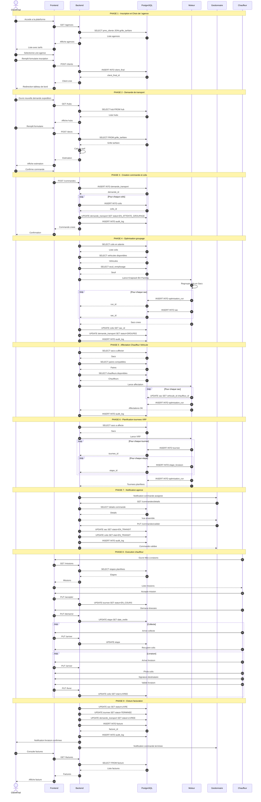
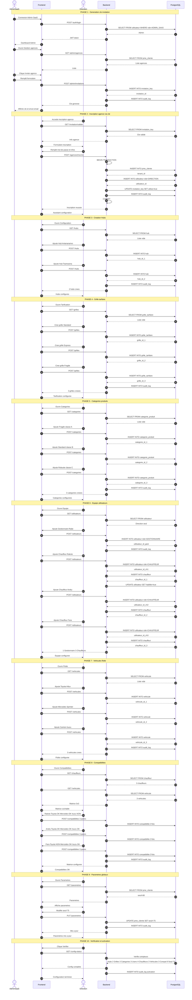

# Diagrammes de Sequence - MadaLogistix

---

## Diagramme 1 : Commande Complete

```mermaid
sequenceDiagram
    autonumber
    actor C as ClientFinal
    participant F as Frontend
    participant A as Backend
    participant D as PostgreSQL
    participant M as Moteur
    participant G as Gestionnaire
    participant H as Chauffeur

    Note over C,H: PHASE 1 - Inscription et Choix de l agence
    C->>F: Accede a la plateforme
    F->>A: GET /agences
    A->>D: SELECT pme_cliente JOIN grille_tarifaire
    D-->>A: Liste agences
    A-->>F: Affiche agences
    F-->>C: Liste avec tarifs
    C->>F: Selectionne une agence
    C->>F: Remplit formulaire inscription
    F->>A: POST /clients
    A->>D: INSERT INTO client_final
    D-->>A: client_final_id
    A-->>F: Client cree
    F-->>C: Redirection tableau de bord

    Note over C,H: PHASE 2 - Demande de transport
    C->>F: Ouvre nouvelle demande expedition
    F->>A: GET /hubs
    A->>D: SELECT hub FROM hub
    D-->>A: Liste hubs
    A-->>F: Affiche hubs
    C->>F: Remplit formulaire
    F->>A: POST /devis
    A->>D: SELECT FROM grille_tarifaire
    D-->>A: Grille tarifaire
    A->>A: Calcule tarif
    A-->>F: Estimation
    F-->>C: Affiche estimation
    C->>F: Confirme commande

    Note over C,H: PHASE 3 - Creation commande et colis
    F->>A: POST /commandes
    A->>D: INSERT INTO demande_transport
    D-->>A: demande_id
    loop Pour chaque colis
        A->>D: INSERT INTO colis
        D-->>A: colis_id
    end
    A->>D: UPDATE demande_transport SET statut=EN_ATTENTE_GROUPAGE
    A->>D: INSERT INTO audit_log
    A-->>F: Commande creee
    F-->>C: Confirmation

    Note over C,H: PHASE 4 - Optimisation groupage
    A->>D: SELECT colis en attente
    D-->>A: Liste colis
    A->>D: SELECT vehicules disponibles
    D-->>A: Vehicules
    A->>D: SELECT seuil_remplissage
    D-->>A: Seuil
    A->>M: Lance Knapsack Bin Packing
    M->>M: Regroupe colis en Sacs
    loop Pour chaque sac
        M->>D: INSERT INTO optimisation_run
        D-->>A: run_id
        M->>D: INSERT INTO sac
        D-->>A: sac_id
    end
    M-->>A: Sacs crees
    A->>D: UPDATE colis SET sac_id
    A->>D: UPDATE demande_transport SET statut=GROUPEE
    A->>D: INSERT INTO audit_log

    Note over C,H: PHASE 5 - Affectation Chauffeur Vehicule
    A->>D: SELECT sacs a affecter
    D-->>A: Sacs
    A->>D: SELECT paires compatibles
    D-->>A: Paires
    A->>D: SELECT chauffeurs disponibles
    D-->>A: Chauffeurs
    A->>M: Lance affectation
    loop Pour chaque sac
        M->>D: UPDATE sac SET vehicule_id chauffeur_id
    end
    M->>D: INSERT INTO optimisation_run
    M-->>A: Affectations OK
    A->>D: INSERT INTO audit_log

    Note over C,H: PHASE 6 - Planification tournees VRP
    A->>D: SELECT sacs a affecte
    D-->>A: Sacs
    A->>M: Lance VRP
    loop Pour chaque tournee
        M->>D: INSERT INTO tournee
        D-->>A: tournee_id
        loop Pour chaque etape
            M->>D: INSERT INTO etape_livraison
            D-->>A: etape_id
        end
    end
    M->>D: INSERT INTO optimisation_run
    M-->>A: Tournees planifiees

    Note over C,H: PHASE 7 - Notification agence
    A->>G: Notification commande assignee
    G->>A: GET /commandes/details
    A->>D: SELECT details commande
    D-->>A: Details
    A-->>G: Vue ensemble
    G->>A: PUT /commandes/valider
    A->>D: UPDATE sac SET statut=EN_TRANSIT
    A->>D: UPDATE colis SET etat=EN_TRANSIT
    A->>D: INSERT INTO audit_log
    A-->>G: Commande validee

    Note over C,H: PHASE 8 - Execution chauffeur
    H->>F: Ouvre Mes Livraisons
    F->>A: GET /missions
    A->>D: SELECT etapes planifiees
    D-->>A: Etapes
    A-->>F: Missions
    F-->>H: Liste missions
    H->>F: Accepte mission
    F->>A: PUT /accepter
    A->>D: UPDATE tournee SET statut=EN_COURS
    H->>F: Demarre itineraire
    F->>A: PUT /demarrer
    A->>D: UPDATE etape SET date_reelle
    loop Collecte
        H->>F: Arrive collecte
        F->>A: PUT /arriver
        A->>D: UPDATE etape
        H->>F: Recupere colis
    end
    loop Livraison
        H->>F: Arrive livraison
        F->>A: PUT /arriver
        H->>F: Photo colis
        H->>F: Signature destinataire
        H->>F: Valide livraison
        F->>A: PUT /livrer
        A->>D: UPDATE colis SET etat=LIVREE
    end

    Note over C,H: PHASE 9 - Cloture facturation
    A->>D: UPDATE sac SET statut=LIVRE
    A->>D: UPDATE tournee SET statut=TERMINEE
    A->>D: UPDATE demande_transport SET statut=LIVREE
    A->>D: INSERT INTO facture
    D-->>A: facture_id
    A->>D: INSERT INTO audit_log
    A->>C: Notification livraison confirmee
    A->>G: Notification commande terminee
    C->>F: Consulte factures
    F->>A: GET /factures
    A->>D: SELECT FROM facture
    D-->>A: Liste factures
    A-->>F: Factures
    F-->>C: Affiche facture
```

---

## Diagramme 2 : Inscription Agence et Configuration

```mermaid
sequenceDiagram
    autonumber
    actor AD as AdminSaaS
    participant F as Frontend
    actor DI as Direction
    participant A as Backend
    participant D as PostgreSQL

    Note over AD,D: PHASE 1 - Generation cle invitation
    AD->>F: Connexion Admin SaaS
    F->>A: POST /auth/login
    A->>D: SELECT FROM utilisateur WHERE role=ADMIN_SAAS
    D-->>A: Admin
    A-->>F: JWT token
    F-->>AD: Dashboard Admin
    AD->>F: Ouvre Gestion agences
    F->>A: GET /admin/agences
    A->>D: SELECT FROM pme_cliente
    D-->>A: Liste agences
    A-->>F: Liste
    AD->>F: Clique Inviter agence
    AD->>F: Remplit formulaire
    F->>A: POST /admin/invitations
    A->>D: INSERT INTO invitation_key
    D-->>A: invitation_id
    A->>D: INSERT INTO audit_log
    A-->>F: Cle generee
    F-->>AD: Affiche cle et envoi email

    Note over AD,D: PHASE 2 - Inscription agence via cle
    DI->>F: Accede inscription agence
    F->>A: GET /invitation/valider
    A->>D: SELECT FROM invitation_key
    D-->>A: Cle valide
    A-->>F: Info agence
    F-->>DI: Formulaire inscription
    DI->>F: Remplit mot de passe et infos
    F->>A: POST /agences/inscrire
    A->>A: BEGIN TRANSACTION
    A->>D: INSERT INTO pme_cliente
    D-->>A: tenant_id
    A->>D: INSERT INTO utilisateur role=DIRECTION
    D-->>A: utilisateur_id
    A->>D: UPDATE invitation_key SET utilise=true
    A->>D: INSERT INTO audit_log
    A->>A: COMMIT
    A-->>F: Inscription reussie
    F-->>DI: Assistant configuration

    Note over AD,D: PHASE 3 - Creation Hubs
    DI->>F: Ouvre Configuration
    F->>A: GET /hubs
    A->>D: SELECT FROM hub
    D-->>A: Liste vide
    DI->>F: Ajoute Hub Antananarivo
    F->>A: POST /hubs
    A->>D: INSERT INTO hub
    D-->>A: hub_id_1
    DI->>F: Ajoute Hub Toamasina
    F->>A: POST /hubs
    A->>D: INSERT INTO hub
    D-->>A: hub_id_2
    A->>D: INSERT INTO audit_log
    A-->>F: 2 hubs crees
    F-->>DI: Hubs configures

    Note over AD,D: PHASE 4 - Grille tarifaire
    DI->>F: Ouvre Tarification
    F->>A: GET /grilles
    A->>D: SELECT FROM grille_tarifaire
    D-->>A: Liste vide
    DI->>F: Cree grille Standard
    F->>A: POST /grilles
    A->>D: INSERT INTO grille_tarifaire
    D-->>A: grille_id_1
    DI->>F: Cree grille Express
    F->>A: POST /grilles
    A->>D: INSERT INTO grille_tarifaire
    D-->>A: grille_id_2
    DI->>F: Cree grille Fragile
    F->>A: POST /grilles
    A->>D: INSERT INTO grille_tarifaire
    D-->>A: grille_id_3
    A->>D: INSERT INTO audit_log
    A-->>F: 3 grilles creees
    F-->>DI: Tarification configuree

    Note over AD,D: PHASE 5 - Categories produits
    DI->>F: Ouvre Categories
    F->>A: GET /categories
    A->>D: SELECT FROM categorie_produit
    D-->>A: Liste vide
    DI->>F: Ajoute Fragile classe A
    F->>A: POST /categories
    A->>D: INSERT INTO categorie_produit
    D-->>A: categorie_id_1
    DI->>F: Ajoute Standard classe B
    F->>A: POST /categories
    A->>D: INSERT INTO categorie_produit
    D-->>A: categorie_id_2
    DI->>F: Ajoute Robuste classe C
    F->>A: POST /categories
    A->>D: INSERT INTO categorie_produit
    D-->>A: categorie_id_3
    A->>D: INSERT INTO audit_log
    A-->>F: 3 categories creees
    F-->>DI: Categories configurees

    Note over AD,D: PHASE 6 - Equipe utilisateurs
    DI->>F: Ouvre Equipe
    F->>A: GET /utilisateurs
    A->>D: SELECT FROM utilisateur
    D-->>A: Direction seul
    DI->>F: Ajoute Gestionnaire Rabe
    F->>A: POST /utilisateurs
    A->>D: INSERT INTO utilisateur role=GESTIONNAIRE
    D-->>A: utilisateur_id_gest
    A->>D: INSERT INTO audit_log
    DI->>F: Ajoute Chauffeur Rakoto
    F->>A: POST /utilisateurs
    A->>D: INSERT INTO utilisateur role=CHAUFFEUR
    D-->>A: utilisateur_id_ch1
    A->>D: INSERT INTO chauffeur
    D-->>A: chauffeur_id_1
    A->>D: UPDATE utilisateur SET habilite=true
    DI->>F: Ajoute Chauffeur Andry
    F->>A: POST /utilisateurs
    A->>D: INSERT INTO utilisateur role=CHAUFFEUR
    D-->>A: utilisateur_id_ch2
    A->>D: INSERT INTO chauffeur
    D-->>A: chauffeur_id_2
    DI->>F: Ajoute Chauffeur Fara
    F->>A: POST /utilisateurs
    A->>D: INSERT INTO utilisateur role=CHAUFFEUR
    D-->>A: utilisateur_id_ch3
    A->>D: INSERT INTO chauffeur
    D-->>A: chauffeur_id_3
    A-->>F: 1 Gestionnaire 3 Chauffeurs
    F-->>DI: Equipe configuree

    Note over AD,D: PHASE 7 - Vehicules flotte
    DI->>F: Ouvre Flotte
    F->>A: GET /vehicules
    A->>D: SELECT FROM vehicule
    D-->>A: Liste vide
    DI->>F: Ajoute Toyota Hilux
    F->>A: POST /vehicules
    A->>D: INSERT INTO vehicule
    D-->>A: vehicule_id_1
    DI->>F: Ajoute Mercedes Sprinter
    F->>A: POST /vehicules
    A->>D: INSERT INTO vehicule
    D-->>A: vehicule_id_2
    DI->>F: Ajoute Camion Isuzu
    F->>A: POST /vehicules
    A->>D: INSERT INTO vehicule
    D-->>A: vehicule_id_3
    A->>D: INSERT INTO audit_log
    A-->>F: 3 vehicules crees
    F-->>DI: Flotte configuree

    Note over AD,D: PHASE 8 - Compatibilites
    DI->>F: Ouvre Compatibilites
    F->>A: GET /chauffeurs
    A->>D: SELECT FROM chauffeur
    D-->>A: 3 chauffeurs
    F->>A: GET /vehicules
    A->>D: SELECT FROM vehicule
    D-->>A: 3 vehicules
    A-->>F: Matrice 3x3
    F-->>DI: Matrice cochable
    DI->>F: Rakoto Toyota OK Mercedes OK Isuzu NON
    F->>A: POST /compatibilites 3 paires
    A->>D: INSERT INTO compatibilite 3 fois
    DI->>F: Andry Toyota OK Mercedes OK Isuzu OK
    F->>A: POST /compatibilites 3 paires
    A->>D: INSERT INTO compatibilite 3 fois
    DI->>F: Fara Toyota NON Mercedes OK Isuzu OK
    F->>A: POST /compatibilites 3 paires
    A->>D: INSERT INTO compatibilite 3 fois
    A->>D: INSERT INTO audit_log
    A-->>F: Matrice configuree
    F-->>DI: Compatibilites OK

    Note over AD,D: PHASE 9 - Parametres globaux
    DI->>F: Ouvre Parametres
    F->>A: GET /parametres
    A->>D: SELECT FROM pme_cliente
    D-->>A: seuil=80
    A-->>F: Parametres
    F-->>DI: Affiche parametres
    DI->>F: Modifie seuil 75
    F->>A: PUT /parametres
    A->>D: UPDATE pme_cliente SET seuil=75
    A->>D: INSERT INTO audit_log
    A-->>F: Mis a jour
    F-->>DI: Parametres mis a jour

    Note over AD,D: PHASE 10 - Verification et activation
    DI->>F: Clique Verifier
    F->>A: GET /config-status
    A->>D: Verifie compteurs
    D-->>A: Hubs 2 Grilles 3 Categories 3 Users 4 Chauffeurs 3 Vehicules 3 Compat 8 Seuil 75
    A-->>F: Config complete
    A->>D: INSERT INTO audit_log activation
    F-->>DI: Configuration terminee
```
