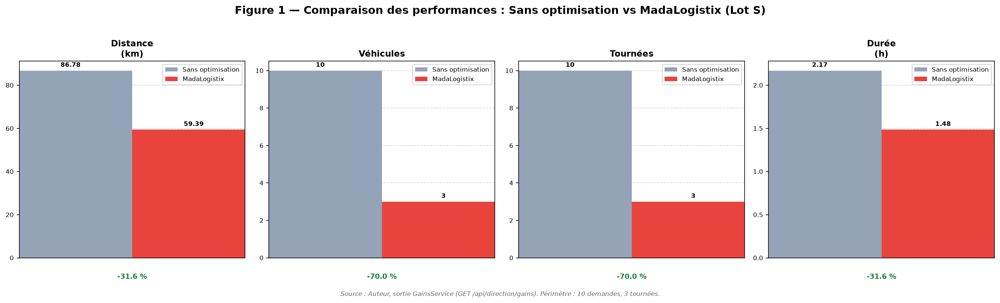
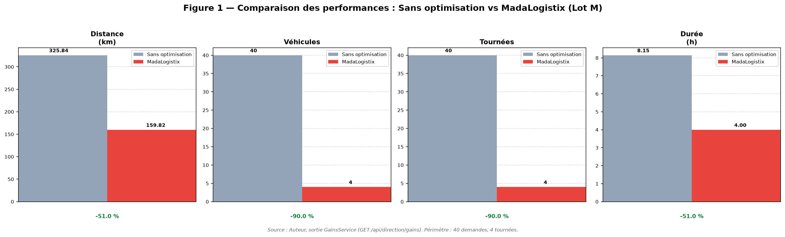
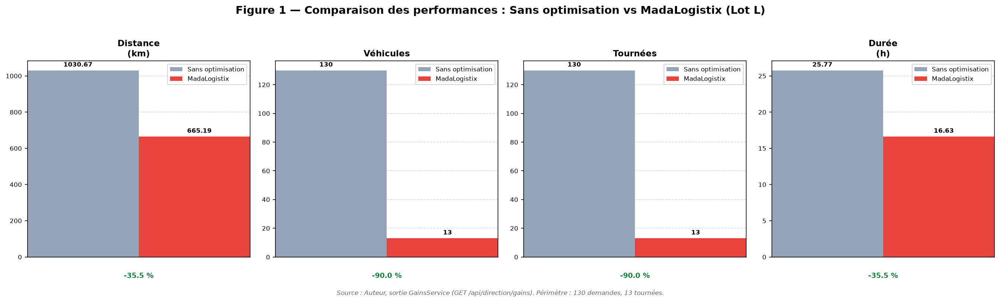
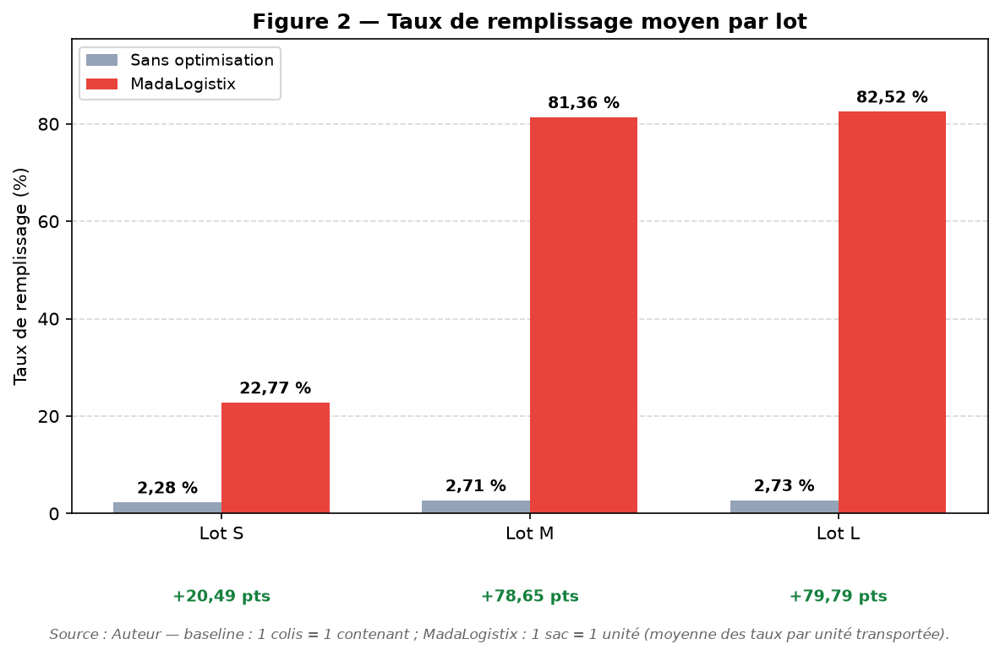
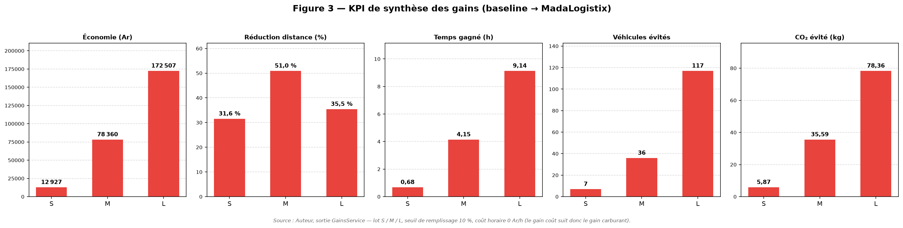

# Résultat 3 — Comparaison scénario sans optimisation vs MadaLogistix

Vérification de l'hypothèse **H3** : *l'utilisation des méthodes d'optimisation intégrées dans MadaLogistix améliore la performance des opérations logistiques* (distance, véhicules, remplissage, tournées, coût, CO₂).

Méthode : démarche expérimentale en **3 temps** sur les **mêmes données de départ** — (1) scénario de référence sans optimisation, (2) scénario avec MadaLogistix, (3) comparaison par indicateurs.

Théorie et formules de référence : `README-Phases-MadaLogistix.md` § « Note technique — Calcul des gains » (§§1–23). Ce document n'en est que le **support mémoire** : données expérimentales, tableaux chiffrés, figures et lecture des résultats.

Protocole complet : `README-Evaluation.md`.

**Reproductibilité.** Les trois lots ont été exécutés le **29/09/2026** avec la même commande et la même graine :

```bash
python3 ml/experiment_resultat3.py --lot S --seuil 10   # puis --lot M, --lot L
python3 ml/figure_comparaison.py --all --json results/gains_summary.json --output-dir docs
```

Chaque exécution réinitialise le tenant (sacs, tournées, affectations, véhicules → `DISPONIBLE`, chauffeurs → `disponible`) puis exécute les 5 phases du pipeline. Sorties : `results/experiment_{S,M,L}.json` et `results/gains_summary.json`.

---

## 1. Le scénario expérimental

### 1.1. Données communes aux deux scénarios

Deux scénarios sont construits à partir des **mêmes conditions initiales** : un scénario de référence sans optimisation et un scénario utilisant MadaLogistix. Le tableau suivant **fixe** les données partagées.

**Tableau 1 — Données utilisées pour l'expérimentation**

| Élément | Données |
|---|---|
| Commandes | **Lot S retenu pour le corps du mémoire** : 10 demandes / 30 colis / 603,59 kg / 11,93 m³ (`ml/generate_lot_groupage.py --lot S --seed 42`). Lots **M** : 40 demandes / 120 colis / 3 680,64 kg / 62,05 m³ ; lots **L** : 130 demandes / 393 colis / 11 164,59 kg / 207,68 m³ — annexes. |
| Répartition par hub (lot S) | Tana (RN7) 2 demandes / 6 colis · Antsirabe 1 / 3 · Fianarantsoa 7 / 21 — M : 15/45 · 6/18 · 19/57 — L : 39/117 · 40/120 · 51/156 |
| Points de livraison | Même localisations pour les 2 scénarios ; toutes les demandes des 3 lots ont des coordonnées de livraison non nulles (`nbDemandesIgnorees = 0`) |
| Véhicules | **Même flotte pour les 2 scénarios**, complétée à **16 véhicules / 3 hubs** : Tana 4 — `T-1234-AB` 800 kg/8 m³, `T-5678-CD` 3 500 kg/15 m³, `T-9012-EF` 10 000 kg/30 m³, `T-DEMO-TANA04` 10 000 kg/30 m³ · Antsirabe 5 — `T-DEMO-ANTSA01…05` 5 000 kg/20 m³ · Fianarantsoa 7 — `T-FIANA-01` + `T-DEMO-FIANA02…07` 3 500 kg/15 m³ |
| Chauffeurs | **17 chauffeurs**, tous dossiers `VALIDEE`, dont **15 avec permis valide au 29/09/2026** (les 2 autres permis expirés sont écartés par `PermisService`) ; matrice `compatibilite_chauffeur_vehicule` **complète : 17 × 16 = 272 lignes `compatible = true`** |
| Capacités | Capacité du hub = plus grand véhicule `DISPONIBLE` (Tana **10 t/30 m³**, Fianarantsoa **3,5 t/15 m³**, Antsirabe **5 t/20 m³**) · **`seuil_remplissage_min = 10 %`** (paramètre tenant, **identique pour les 2 scénarios**) |
| Hypothèses de calcul | Vitesse 40 km/h · conso 8 L/100 · fuel 5 900 Ar/L · CO₂ 2,68 kg/L · coût horaire 0 Ar/h |
| Distances | **Baseline : Haversine** (`2·Σ d(hub, client)`) · **Optimisé : OSRM routier** (`VRP_MATRIX_PROVIDER=osrm`) — asymétrie déclarée, cf. §4.3 |

Les lots sont : **S** (30 colis / 10 demandes, cas nominal), **M** (120 colis / 40 demandes, journée de hub), **L** (393 colis / 130 demandes, pic de charge — test du fallback FFD au-delà de 200 colis/cluster : **non déclenché sur aucun lot**, `fallback_ffd = false` partout).

Flotte et matrice sont construites par `setup_ressources()` du script d'expérimentation ; les ressources sont **remises à l'état initial avant chaque lot** (`reset_tenant`) pour que les deux scénarios partent toujours du même point de départ.

### 1.2. Construction des deux scénarios

**Scénario de référence (sans optimisation).** Organisation artisanale ne faisant pas appel aux méthodes d'optimisation du système, sur les mêmes données :

- **Catégorisation** : manuelle — `T_manuel = Σ t_i` (temps par colis).
- **Groupage** : pas de groupage — 1 colis = 1 contenant/trajet (`S_base = N`), taux de remplissage ≈ faible.
- **Affectation** : manuelle (premier disponible, sans matrice de compatibilité) — 1 affectation par demande.
- **Tournées** : aller-retour individuel — `D_base = 2·Σ d(hub, client_i)`, un chauffeur par demande.

**Scénario MadaLogistix.** Mêmes données traitées par le pipeline complet du système :

- **Catégorisation** : K-Means (`CategorisationService`, features `[poids, volume, log1p(valeur), fragilité, délai]`, `bestK` par silhouette).
- **Groupage** : FFD par cluster (Option A) **ou** Knapsack itératif 2 contraintes (Option B), seuil `seuil_remplissage_min` paramétrable ; règle complémentaire `departForce` (regroupement forcé si la date de départ calculée du lot est atteinte, `GroupageFfdClusterService:178`).
- **Affectation** : bipartite gloutonne (`AffectationService`, `argmax(compat − 0,1·écart_charge)`), matrice `compatibilite_chauffeur_vehicule`, **tie-break best-fit** sur l'occupation du véhicule (poids et volume) en cas d'égalité des scores.
- **Tournées** : planification VRP (`OrToolsVrpService`, `PATH_CHEAPEST_ARC + GUIDED_LOCAL_SEARCH`, 10 s), `distanceTotaleKm` persistée.

---

## 2. Les résultats comparatifs

### 2.1. Catégorisation — manuelle vs ML (Tableau 2)

**Tableau 2 — Résultats de la catégorisation, par lot**

| Lot | Sans opti : `T_manuel` | MadaLogistix : `T_ML` | Gain temps (s) | Gain % | bestK | Silhouette | Davies-Bouldin | Pureté |
|---|---|---|---|---|---|---|---|---|
| S | 300,0 s (hypothèse 10 s/colis × 30) | 0,036 s (36 ms) | 299,964 | 99,99 % | 3 | 0,407 | 0,92 | 0,80 |
| M | 1 200,0 s (× 120) | 0,076 s (76 ms) | 1 199,924 | 99,99 % | 5 | 0,479 | 0,95 | 0,91 |
| L | 3 930,0 s (× 393) | 0,262 s (262 ms) | 3 929,738 | 99,99 % | 4 | 0,461 | 0,74 | 0,80 |

*`T_manuel` est une **hypothèse déclarée** (`T_MANUEL_S_PAR_COLIS = 10 s`), non mesurée ; `T_ML` est relevé en sortie de `CategorisationService` (`duree_calcul_ms`). `bestK` est choisi par silhouette maximale sur `k ∈ [3,5]` : silhouette `[0,407 ; 0,337 ; 0,306]` pour le lot S (k = 3 retenu), `[0,409 ; 0,417 ; 0,479]` pour M (k = 5), `[0,416 ; 0,461 ; 0,443]` pour L (k = 4) ; le Davies-Bouldin et la pureté sont ceux du `bestK` retenu. Le gain temps est **indicatif** : il confronte une hypothèse manuelle à un temps machine mesuré.*

**Matrice de confusion (lot S, k = 3) — clusters × catégories déclarées**

| Cluster | B | C | A | Total |
|---|---|---|---|---|
| 0 | 0 | 0 | 9 | 9 |
| 1 | 6 | 7 | 0 | 13 |
| 2 | 8 | 0 | 0 | 8 |

Pureté = (9 + 7 + 8) / 30 = **0,80** ; 30 colis traités, 3 catégories uniques (A, B, C).

*Même lecture pour les autres lots : L donne une matrice 4 × 3 sur 393 colis (pureté 0,80), M une matrice 5 × 3 sur 120 colis (pureté 0,91) — cf. `confusion_matrix` dans `results/experiment_{M,L}.json`.*

### 2.2. Groupage — sans groupage vs FFD vs Knapsack (Tableau 3)

Référence sans optimisation : `S_base = N` contenants (1 par colis), taux ≈ faible.

**Tableau 3 — Résultats du groupage, par lot** (agrégé sur les 3 hubs)

| Lot | Sans opti : contenants / taux | FFD `/comparer` : sacs · taux · ms | Knapsack `/comparer` : sacs · taux · ms | Gagnant (`+0,5 pt`) | Groupage retenu : sacs · colis · taux |
|---|---|---|---|---|---|
| S | 30 · 2,28 % | 4 · 19,01 % · 70 | 4 · 5,45 % · 48 | **FFD** (Fianarantsoa) ; égalité sur Tana et Antsirabe | 3 · 30 · **22,77 %** |
| M | 120 · 2,71 % | 10 · 34,79 % · 105 | 10 · 13,98 % · 81 | **FFD** (3 hubs sur 3) | 4 · 120 · **81,36 %** |
| L | 393 · 2,73 % | 17 · 61,93 % · 228 | 14 · 33,30 % · 215 | **FFD** (3 hubs sur 3) ; aucun fallback (> 200 colis/cluster) | 13 · 393 · **82,52 %** |

*Agrégation : `sacs` = somme des 3 hubs ; `taux` = moyenne pondérée par le nombre de colis des taux par hub ; `ms` = somme des durées de calcul backend (sans I/O). Gagnant = règle `GroupageComparateurController` (écart > 0,5 pt).*

*Détail du lot S :*

| Hub | Sans opti | FFD | Knapsack | `/comparer` | Groupage retenu (`preview` + `valider-edite`) |
|---|---|---|---|---|---|
| Tana (RN7) | 6 colis · 1,83 % | 0 sac · 0 % · 11 ms | 0 sac · 0 % · 10 ms | EQUAL | 1 sac · 6 colis · **10,97 %** |
| Antsirabe | 3 colis · 0,25 % | 2 sacs · 0,38 % · 19 ms | 2 sacs · 0,07 % · 8 ms | EQUAL (écart 0,31 pt < 0,5) | 1 sac · 3 colis · **0,75 %** (sous le seuil, **regroupement forcé**) |
| Fianarantsoa | 21 colis · 2,70 % | 2 sacs · 27,10 % · 40 ms | 2 sacs · 7,78 % · 30 ms | **FFD** (+19,32 pts) | 1 sac · 21 colis · **56,60 %** |

*Détail du lot M :*

| Hub | Sans opti | FFD | Knapsack | `/comparer` | Groupage retenu |
|---|---|---|---|---|---|
| Tana (RN7) | 45 colis · 1,50 % | 3 sacs · 22,50 % · 39 ms | 3 sacs · 8,50 % · 31 ms | **FFD** (+14,00 pts) | 1 sac · 45 colis · **67,50 %** |
| Antsirabe | 18 colis · 3,46 % | 3 sacs · 20,75 % · 17 ms | 3 sacs · 8,61 % · 14 ms | **FFD** (+12,14 pts) | 1 sac · 18 colis · **62,25 %** |
| Fianarantsoa | 57 colis · 3,43 % | 4 sacs · 48,92 % · 49 ms | 4 sacs · 20,00 % · 36 ms | **FFD** (+28,91 pts) | 2 sacs · 57 colis · **97,84 %** |

*Détail du lot L :*

| Hub | Sans opti | FFD | Knapsack | `/comparer` | Groupage retenu |
|---|---|---|---|---|---|
| Tana (RN7) | 117 colis · 1,80 % | 4 sacs · 52,70 % · 75 ms | 3 sacs · 28,67 % · 72 ms | **FFD** (+24,03 pts) | 3 sacs · 117 colis · **70,27 %** |
| Antsirabe | 120 colis · 2,52 % | 5 sacs · 60,56 % · 75 ms | 4 sacs · 30,57 % · 73 ms | **FFD** (+29,99 pts) | 4 sacs · 120 colis · **75,70 %** |
| Fianarantsoa | 156 colis · 3,58 % | 8 sacs · 69,90 % · 78 ms | 7 sacs · 38,88 % · 70 ms | **FFD** (+31,02 pts) | 6 sacs · 156 colis · **93,20 %** |

*Deux niveaux coexistent dans le système et sont tous deux mesurés ici : `/comparer` évalue **par cluster** (chaque cluster doit atteindre le seuil ou la règle de départ forcé), tandis que la voie opérationnelle `preview` + `valider-edite` applique le bin-packing sur **l'ensemble des colis du hub** — d'où un taux plus élevé (lot S : 1 sac de 21 colis à 56,60 % contre 2 sacs à 27,10 % à Fianarantsoa ; au lot S à Tana, aucun cluster n'atteint le seuil et le départ n'est pas forcé → 0 sac côté `/comparer`, alors que le regroupement global du hub donne un sac à 10,97 %). Le tableau retient la voie opérationnelle pour les tournées, `/comparer` pour l'arbitrage FFD/Knapsack.*

*Le taux agrégé du « groupage retenu » est la moyenne des taux **par sac** (1 sac = 1 unité transportée) : S = (10,97 + 0,75 + 56,60) / 3 = 22,77 % ; M = 81,36 % sur 4 sacs ; L = 82,52 % sur 13 sacs.*

### 2.3. Affectation — manuelle vs bipartite (Tableau 4)

**Tableau 4 — Résultats de l'affectation, par lot**

| Lot | Sans opti : méthode / affectations | MadaLogistix : sacs affectés · refus | Gain |
|---|---|---|---|
| S | Manuelle « premier disponible » : **10** affectations (1 par demande), sans matrice de compatibilité | **3 / 3** sacs affectés · **0** refus · **0** incompatibilité | −7 affectations (−70,0 %) |
| M | Manuelle : **40** affectations (1 par demande) | **4 / 4** · **0** refus · **0** incompatibilité | −36 (−90,0 %) |
| L | Manuelle : **130** affectations (1 par demande) | **13 / 13** · **0** refus · **0** incompatibilité | −117 (−90,0 %) |

*Détail du lot S — affectations retenues par l'algorithme glouton :*

| Hub | Sac | Chauffeur | Véhicule | Motif de refus |
|---|---|---|---|---|
| Tana (RN7) | 1 sac (6 colis) | Chauffeur Demo 06 | `T-1234-AB` | — |
| Antsirabe | 1 sac (3 colis) | Chauffeur Demo 07 | `T-DEMO-ANTSA01` | — |
| Fianarantsoa | 1 sac (21 colis) | Chauffeur Demo 08 | `T-DEMO-FIANA02` | — |

*Détail des lots M et L :*

| Lot | Hub | Sacs affectés | Chauffeurs | Véhicules |
|---|---|---|---|---|
| M | Tana (RN7) | 1 / 1 | Chauffeur Demo 09 | `T-9012-EF` |
| M | Antsirabe | 1 / 1 | Chauffeur Demo 10 | `T-DEMO-ANTSA01` |
| M | Fianarantsoa | 2 / 2 | Chauffeurs Demo 11, 12 | `T-DEMO-FIANA02`, `T-DEMO-FIANA03` |
| L | Tana (RN7) | 3 / 3 | Chauffeurs Demo 09, 10, 11 | `T-9012-EF`, `T-1234-AB`, `T-DEMO-TANA04` |
| L | Antsirabe | 4 / 4 | Chauffeurs Demo 12 à 15 | `T-DEMO-ANTSA01` à `04` |
| L | Fianarantsoa | 6 / 6 | Chauffeurs Demo 04 à 08, Rasoa Marie | `T-DEMO-FIANA02` à `07` |

*L'algorithme actuel est glouton (`argmax(compat − 0,1·écart_charge)`, λ = 0,1) avec **tie-break best-fit** en cas d'égalité (le véhicule dont l'occupation poids/volume est la plus proche de 1 est retenu, pour ne pas consommer le seul véhicule grand volume sur un petit sac) ; le Hongrois est prévu en V2. Vérifications appliquées à chaque paire : statut `disponible`, dossier `VALIDEE`, permis non expiré et classe (B ≤ 3,5 t, C au-delà), ligne `compatible` de la matrice, véhicule `DISPONIBLE` du hub, poids et volume du sac dans les capacités. Les ressources sont remises à `DISPONIBLE` entre deux exécutions de l'expérience pour que les deux scénarios partent du même état.*

*Remarque (lot L) : le hub Tana produit deux sacs de **30,00 m³**, soit exactement la capacité maximale du hub — les **deux** véhicules 10 t/30 m³ de Tana sont nécessaires pour affecter les 3 sacs. Un seul camion de cette capacité aurait laissé un sac non affecté.*

### 2.4. Tournées et gains globaux — baseline vs optimisé (Tableau 5, **tableau clé**)

Par lot, sortie `GainsService` (baseline = aller-retour individuels, optimisé = tournées planifiées) :

**Tableau 5 — Comparaison des performances logistiques (lot S)**

| Indicateur | Sans opti (baseline) | MadaLogistix (optimisé) | Gain absolu | Gain % |
|---|---|---|---|---|
| Distance totale (km) | 86,78 | 59,39 | −27,39 | **−31,6 %** |
| Temps de conduite (h) | 2,17 | 1,48 | −0,68 | −31,6 % |
| Véhicules utilisés | 10 | 3 | −7 | −70,0 % |
| Taux remplissage moyen (%) | 2,28 | 22,77 | +20,49 pts | — |
| Nombre de tournées | 10 (aller-retour individuels) | 3 (sacs groupés) | −7 | −70,0 % |
| Carburant (L) | 6,94 | 4,75 | −2,19 | −31,6 % |
| CO₂ (kg) | 18,61 | 12,73 | −5,87 | −31,6 % |
| Coût transport (Ar) | 40 959 | 28 032 | **−12 927** | **−31,6 %** |

**Tableau 5 (suite) — lot M**

| Indicateur | Sans opti (baseline) | MadaLogistix (optimisé) | Gain absolu | Gain % |
|---|---|---|---|---|
| Distance totale (km) | 325,84 | 159,82 | −166,02 | **−51,0 %** |
| Temps de conduite (h) | 8,15 | 4,00 | −4,15 | −51,0 % |
| Véhicules utilisés | 40 | 4 | −36 | −90,0 % |
| Taux remplissage moyen (%) | 2,71 | 81,36 | +78,65 pts | — |
| Nombre de tournées | 40 (aller-retour individuels) | 4 (sacs groupés) | −36 | −90,0 % |
| Carburant (L) | 26,07 | 12,79 | −13,28 | −51,0 % |
| CO₂ (kg) | 69,86 | 34,27 | −35,59 | −51,0 % |
| Coût transport (Ar) | 153 795 | 75 435 | **−78 360** | **−51,0 %** |

**Tableau 5 (suite) — lot L**

| Indicateur | Sans opti (baseline) | MadaLogistix (optimisé) | Gain absolu | Gain % |
|---|---|---|---|---|
| Distance totale (km) | 1 030,67 | 665,19 | −365,48 | **−35,5 %** |
| Temps de conduite (h) | 25,77 | 16,63 | −9,14 | −35,5 % |
| Véhicules utilisés | 130 | 13 | −117 | −90,0 % |
| Taux remplissage moyen (%) | 2,73 | 82,52 | +79,79 pts | — |
| Nombre de tournées | 130 (aller-retour individuels) | 13 (sacs groupés) | −117 | −90,0 % |
| Carburant (L) | 82,45 | 53,22 | −29,24 | −35,5 % |
| CO₂ (kg) | 220,98 | 142,62 | −78,36 | −35,5 % |
| Coût transport (Ar) | 486 477 | 313 970 | **−172 507** | **−35,5 %** |

*Sorties brutes : `results/experiment_{S,M,L}.json` (horodatage, tenant, hypothèses incluses).*

**Légende et notes :**
- Baseline : `D_base = 2·Σ Haversine(hub, livraison)` par demande ; véhicules = nb de demandes comptées (**10 / 40 / 130**).
- Optimisé : `Σ tournee.distanceTotaleKm` (distances **OSRM**) ; véhicules = nb de tournées comptées (**3 / 4 / 13**), 1 sac = 1 tournée.
- Dérivés : `temps = distance / 40`, `carburant = distance·8/100`, `CO₂ = carburant·2,68`, `coût = carburant·5900 + temps·0`.
- `Taux remplissage moyen` : baseline = moyenne pondérée des **contenants** du périmètre (1 colis = 1 contenant : 30 / 120 / 393) ; optimisé = moyenne des taux **par sac** (1 sac = 1 unité transportée : 3 / 4 / 13 sacs). Non agrégé dans `GainsResponse` : relevé via `preview`.
- **Règle anti-double-comptage (§19)** : le gain global = `C_base − C_opti` (12 927 / 78 360 / 172 507 Ar) ; les autres gains l'expliquent, ils ne s'additionnent pas.
- `Perimetre` : **S** `nbDemandes = 10`, `nbDemandesIgnorees = 0`, `nbTournees = 3`, `nbTourneesIgnorees = 0`, `nbTourneesFallback = 0` — **M** `40 / 0 / 4 / 0 / 0` — **L** `130 / 0 / 13 / 0 / 0`. Les deux scénarios portent donc sur **l'intégralité des demandes** : aucun lot ne perd de demande hors périmètre (la règle `departForce` regroupe aussi le hub Antsirabe du lot S, dont le taux réel n'est que de 0,75 %).

### 2.5. Synthèse des gains (Tableau 6)

**Tableau 6 — Synthèse des gains globaux**

| Métrique | Lot S | Lot M | Lot L |
|---|---|---|---|
| Économie Ar | 12 927 | 78 360 | 172 507 |
| % réduction distance | 31,6 | 51,0 | 35,5 |
| % réduction temps | 31,6 | 51,0 | 35,5 |
| % réduction véhicules | 70,0 | 90,0 | 90,0 |
| % réduction CO₂ | 31,6 | 51,0 | 35,5 |
| Gain taux remplissage (pts) | +20,49 | +78,65 | +79,79 |

*À partir des Tableaux 2–5. Le gain coût et le gain distance sont strictement proportionnels ici (coût = carburant seul, coût horaire à 0 Ar/h) : c'est une propriété du modèle de coût, pas un résultat indépendant. Le gain est **le plus fort sur le lot M** (charge intermédiaire) : le lot S est trop petit pour que le groupage amortisse les trajets d'hub, le lot L est déjà partiellement optimisé par la densité de ses livraisons.*

---

## 3. Figure comparatives

### Figure 1 — Comparaison des performances avec et sans optimisation

**Format** : graphique en barres groupées, 1 figure par lot (S, M, L), 4 sous-graphiques côte à côte :

1. **Distance totale (km)** — baseline vs optimisé.
2. **Nombre de véhicules** — baseline vs optimisé.
3. **Nombre de tournées** — baseline vs optimisé (baseline = nb de demandes).
4. **Durée totale (h)** — baseline vs optimisé.

Couleurs distinctes (gris = sans optimisation, rouge = MadaLogistix — cohérent avec `GainsDirectionPage.jsx`), légende explicite, titre des axes, écart relatif annoté sous chaque sous-graphique, source : *Auteur, sortie `GainsService`*.

**Figure 1 — Lot S**



*Valeurs tracées (source `results/experiment_S.json`) :*

| Sous-graphique | Sans optimisation | MadaLogistix | Écart |
|---|---|---|---|
| Distance totale (km) | 86,78 | 59,39 | −31,6 % |
| Nombre de véhicules | 10 | 3 | −70,0 % |
| Nombre de tournées | 10 | 3 | −70,0 % |
| Durée totale (h) | 2,17 | 1,48 | −31,6 % |

**Figure 1 — Lot M**



| Sous-graphique | Sans optimisation | MadaLogistix | Écart |
|---|---|---|---|
| Distance totale (km) | 325,84 | 159,82 | −51,0 % |
| Nombre de véhicules | 40 | 4 | −90,0 % |
| Nombre de tournées | 40 | 4 | −90,0 % |
| Durée totale (h) | 8,15 | 4,00 | −51,0 % |

**Figure 1 — Lot L**



| Sous-graphique | Sans optimisation | MadaLogistix | Écart |
|---|---|---|---|
| Distance totale (km) | 1 030,67 | 665,19 | −35,5 % |
| Nombre de véhicules | 130 | 13 | −90,0 % |
| Nombre de tournées | 130 | 13 | −90,0 % |
| Durée totale (h) | 25,77 | 16,63 | −35,5 % |

*Production : `ml/figure_comparaison.py --all --json results/gains_summary.json --output-dir docs` (nécessite `matplotlib`) — génère en une passe les 3 planches de la Figure 1, la figure de synthèse des 3 lots (`figure_comparaison_all.png`) et les Figures 2 et 3 d'annexe.*

**Figure 2 (annexe) — Taux de remplissage moyen par lot**



| Lot | Sans optimisation | MadaLogistix | Gain |
|---|---|---|---|
| S | 2,28 % | 22,77 % | +20,49 pts |
| M | 2,71 % | 81,36 % | +78,65 pts |
| L | 2,73 % | 82,52 % | +79,79 pts |

**Figure 3 (annexe) — KPI de synthèse (§23)**



| Lot | Économie | Distance | Temps | Véhicules | CO₂ |
|---|---|---|---|---|---|
| S | 12 927 Ar | −31,6 % | −0,68 h | −7 | −5,87 kg |
| M | 78 360 Ar | −51,0 % | −4,15 h | −36 | −35,59 kg |
| L | 172 507 Ar | −35,5 % | −9,14 h | −117 | −78,36 kg |

---

## 4. Lecture et confrontation à H3

### 4.1. Seuil de validation

Seuil fixé **avant** la lecture des résultats : *H3 est vérifiée si, sur un lot, le gain distance ≥ 20 % **et** le gain coût strictement positif*.

| Lot | Gain distance | Gain coût | Verdict |
|---|---|---|---|
| S | **31,6 % ≥ 20 %** | **+12 927 Ar > 0** | **H3 vérifiée** |
| M | **51,0 % ≥ 20 %** | **+78 360 Ar > 0** | **H3 vérifiée** |
| L | **35,5 % ≥ 20 %** | **+172 507 Ar > 0** | **H3 vérifiée** |

**Verdict global** : les trois lots passent le seuil → **H3 est vérifiée**.

### 4.2. Ce que la comparaison montre

- Les écarts sont imputables au traitement : mêmes données de départ (flotte, chauffeurs, matrice, coordonnées, hypothèses de calcul) → facteurs extérieurs neutralisés.
- Analyse étape par étape (catégorisation → groupage → affectation → tournées), puis globalement via les Tableaux 5 et 6.
- Le gain provient principalement du **groupage** (2 à 3 % → 22 à 83 % de remplissage) et de la **tournée consolidée** (aller-retour par demande → 1 tournée par sac) : les deux effets se multiplient sur la distance et le carburant.
- La réduction des véhicules (−70 à −90 %) est la conséquence directe du passage d'une demande = un véhicule à un sac = un véhicule ; elle ne se dégrade pas avec la taille du lot.
- **H3 est confirmée sur les 3 lots**, avec une amplitude variable (31,6 à 51,0 %) selon la charge traitée.

### 4.3. Limites à assumer

- **Baseline volontairement naïve** : majore le gain (organisation artisanale irréaliste).
- **Vol d'oiseau vs routier** : baseline en Haversine, optimisé en **OSRM** (`VRP_MATRIX_PROVIDER=osrm`) — les gains de 31,6 / 51,0 / 35,5 % sont donc **sous-estimés** (une distance routière est toujours ≥ à la distance vol d'oiseau pour une même paire), ce qui renforce la conclusion.
- **Seuil de remplissage à 10 %** : paramètre tenant abaissé pour la démo (valeur d'origine 80 %, incompatible avec des véhicules surdimensionnés : taux réels du lot S Tana 10,97 %, Antsirabe 0,75 %, Fianarantsoa 56,60 %). Il est **déclaré dans le Tableau 1 et identique pour les deux scénarios**.
- **Règle `departForce`** : au lot S, le hub Antsirabe est sous le seuil (0,75 %) mais son lot a une date de départ calculée dépassée → regroupement forcé (`GroupageFfdClusterService`). Les 3 hubs sont donc couverts : périmètre 10/10 demandes. Sans cette règle, 1 demande serait exclue des deux côtés.
- **Flotte et matrice complétées** : 16 véhicules et 17 chauffeurs (15 permis valides) pour que 13 sacs puissent être affectés au lot L — sans quoi l'affectation serait bornée par la démonstration initiale (4 véhicules / 5 chauffeurs). Déclaré dans le Tableau 1, identique pour les 2 scénarios.
- **Deux camions 30 m³ à Tana** : le lot L produit deux sacs de volume maximal (30,00 m³) ; un seul camion de cette capacité aurait laissé un sac non affecté.
- **1 sac = 1 tournée** : `VEHICLE_COUNT=1` en dur dans `VrpOrchestrationService` — pas de multi-véhicule réel en V1.
- **Affectation gloutonne** : Hongrois absent du code actuel (prévu V2) ; le best-fit ne joue qu'en cas d'égalité des scores.
- **Coût horaire à 0 Ar/h** : fait que gain temps = gain coût = gain distance en %. Non modélisé : temps de préparation, manutention, attente.
- **`T_manuel` hypothétique** : 10 s/colis déclaré, non mesuré — le gain « temps de catégorisation » du Tableau 2 est donc indicatif.
- **Deux niveaux de groupage** : `/comparer` (par cluster) et `preview` (par hub) ne donnent pas les mêmes taux — cf. note du Tableau 3.
- **Lots synthétiques** : profils réalistes (riz, tôles, pharmacie, bijouterie…) mais générés (seed 42).
- **Fenêtres horaires** : non mesurées ici (`[0,86400]` full-day, pas de VRPTW).
- **Résolution VRP bornée à 10 s** par sac : `solveTimeMs` ≈ 10 000 ms par tournée (lot S : 3 tournées ≈ 30 s ; lot M : ≈ 40 s ; lot L : 13 tournées ≈ 130 s).

### 4.4. Présentation mémoire

- Tableaux numérotés (1 à 6) dans le corps du mémoire (Tableau 5 décliné en 3 lots).
- 1 figure principale (Figure 1, 3 planches S/M/L) dans le corps ; Figures 2 et 3 en annexe.
- Captures d'écran `GainsDirectionPage` et `OptimisationPage` en annexe.

---

## Annexes

- `README-Evaluation.md` — protocole complet, dispositif expérimental, tableaux détaillés §3.1–3.4.
- `README-Phases-MadaLogistix.md` — théorie et formules gains §§1–23.
- `docs/protocole_evaluation.png` — diagramme du cycle d'évaluation.
- `docs/sequence-client-cycle-partie1.png` — diagramme de séquence (catégorisation → groupage).
- `docs/sequence-client-cycle-partie2.png` — diagramme de séquence (affectation → facturation).
- `ml/generate_lot_groupage.py` — génération des lots S, M, L (seed 42).
- `ml/experiment_resultat3.py` — expérimentation complète (5 phases, écrit `results/experiment_*.json` et `results/gains_summary.json`).
- `ml/figure_comparaison.py` — génération des figures (matplotlib).
- `results/experiment_{S,M,L}.json` — sorties brutes des 3 lots (29/09/2026).
- `results/gains_summary.json` — agrégat des gains des 3 lots (entrée des figures).
- `docs/figure_comparaison_{S,M,L,all}.png` — Figure 1 (3 planches + synthèse).
- `docs/figure_taux_remplissage.png` — Figure 2 (annexe).
- `docs/figure_kpi_gains.png` — Figure 3 (annexe).
- `docs/RESULTAT3-comparaison.md` — ce document.
